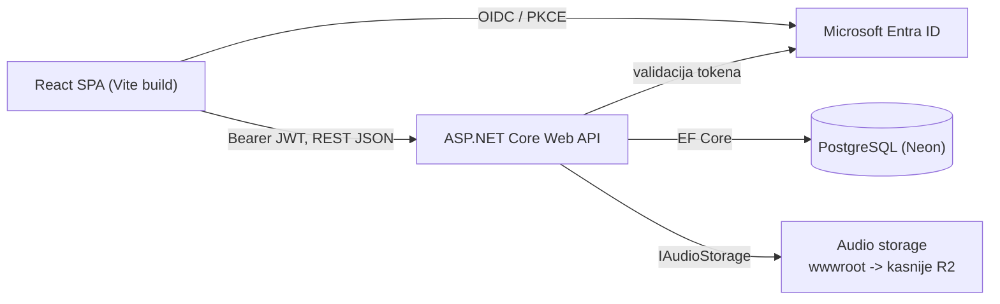

# 01 - Arhitektura

Tehnička specifikacija aplikacije **Critical Listening Lab** - web aplikacije za trening kritičkog slušanja i prepoznavanje audio obrade.

Ovaj dokument je rezultat Phase 1 i referentna je točka za sve kasnije faze. Ako se tijekom implementacije pokaže da neki dio specifikacije treba promjenu, prvo se mijenja ovaj dokument (i [07-decisions.md](07-decisions.md)), a tek onda kod.

Dokumenti:

- `01-architecture.md` - ovaj dokument: struktura rješenja, tech stack, granice
- [02-data-model.md](02-data-model.md) - ER model, entiteti, seed podaci
- [03-progression.md](03-progression.md) - progression i unlock model
- [04-api.md](04-api.md) - API površina, test session lifecycle, sigurnosne provjere
- [05-auth.md](05-auth.md) - autentikacija i autorizacija
- [06-audio.md](06-audio.md) - audio storage abstrakcija i Web Audio engine
- [07-decisions.md](07-decisions.md) - arhitektonske odluke i obrazloženja
- [08-implementation-plan.md](08-implementation-plan.md) - plan implementacije po fazama

---

## 1. Cilj i doseg

Aplikacija omogućuje studentima multimedije/audio produkcije da kroz nizove testova treniraju prepoznavanje:

- **EQ** - koja je frekvencija promijenjena i u kojem smjeru (boost/cut)
- **Compression** - je li signal komprimiran, koliko, i s kojim omjerom

Napredak se vodi neovisno po kombinaciji **Student → Modul → Audio izvor → Exercise level**. EQ ima branching progression tree (BOOST → CUT → COMBINED), Compression linearni niz od tri levela.

Trenutni doseg su **dva modula** (EQ, Compression) i **šest audio izvora** (EQ: Pink Noise, Drums, Acoustic Guitar, Vocal; Compression: Drums, Vocal). Model je podatkovno vođen tako da se novi moduli, izvori, leveli i tipovi vježbi dodaju kao podaci, bez refaktoringa.

---

## 2. Tech stack

### Backend

| Područje | Odabir |
| --- | --- |
| Runtime | .NET 10 (LTS do 11/2028) |
| Web | ASP.NET Core Web API (controllers) |
| ORM | Entity Framework Core 10 + Npgsql |
| Baza | PostgreSQL (hosting: Neon.tech) |
| Auth | Microsoft Entra ID (Azure AD), `Microsoft.Identity.Web` |
| Testovi | xUnit + FluentAssertions; prava PostgreSQL baza za integracijske testove (zbog `jsonb`) |

Početna specifikacija je predviđala .NET 8, ali je promijenjena na .NET 10 - obrazloženje u [07-decisions.md](07-decisions.md#odluka-21---net-10-umjesto-net-8).

### Frontend

| Područje | Odabir |
| --- | --- |
| Framework | React 18 + TypeScript |
| Build | Vite |
| Stil | Tailwind CSS |
| Routing | React Router |
| Server state | TanStack Query |
| Auth | `@azure/msal-browser` + `@azure/msal-react` |
| Audio | Web Audio API (bez biblioteka) |

TanStack Query je jedina "dodatna" biblioteka za stanje i opravdana je konkretnom potrebom: progress i progression tree se cache-aju i moraju se invalidirati nakon završenog testa. Bez nje bismo isti mehanizam pisali ručno. **Nema** Reduxa, Zustanda ni drugog globalnog store-a - autentikacijski kontekst dolazi iz MSAL providera, ostalo je server state ili lokalni state komponente.

---

## 3. Struktura repozitorija

Jedan repozitorij, dvije nezavisno deployane aplikacije:

```
App/
  CriticalListeningLab.sln
  docs/                                  # ova specifikacija
  backend/
    src/CriticalListeningLab.Api/
      Program.cs
      appsettings.json
      appsettings.Development.json
      Auth/                              # Entra ID, claims transform, domain allow-list, dev bypass
      Data/
        AppDbContext.cs
        Configurations/                  # IEntityTypeConfiguration po entitetu
        Migrations/
        Seed/                            # moduli, izvori, segmenti, leveli, unlock pravila
      Domain/                            # entiteti + čista logika (bez EF ovisnosti)
        Entities/
        Progression/                     # unlock evaluacija, scoring
        Questions/                       # generatori pitanja
      Features/                          # endpointi grupirani po području
        Modules/
        Progress/
        TestSessions/
        Audio/
        Admin/
      Audio/                             # IAudioStorage + implementacije
      wwwroot/audio/                     # lokalni audio assetovi (dev faza)
    tests/CriticalListeningLab.Tests/
      Progression/
      Questions/
      Api/                               # integracijski testovi preko WebApplicationFactory
  frontend/
    index.html
    vite.config.ts
    tailwind.config.js
    src/
      main.tsx
      App.tsx
      api/                               # typed fetch klijent + auth interceptor
      auth/                              # MSAL konfiguracija, provider, dev bypass
      audio/                             # EqPlaybackEngine, AudioBufferCache, hooks
      features/
        dashboard/
        module/
        source/                          # progression tree
        test/                            # test runner, question view, result
        practice/
        admin/
      components/                        # UI primitivi (Button, Card, ProgressBar, ...)
      lib/                               # formatiranje, konstante, hrvatski stringovi
      styles/
```

### Zašto jedan backend projekt

Cijela poslovna logika koja zahtijeva unit testove - unlock evaluacija, scoring, generiranje pitanja - napisana je kao **čiste klase u `Domain/` bez EF ili ASP.NET ovisnosti**, koje primaju podatke kao argumente i vraćaju rezultat. To daje testabilnost koja je glavni argument za podjelu na assembly-e, bez cijene te podjele.

Podjela na `Api` / `Application` / `Domain` / `Infrastructure` projekte bila bi četiri `.csproj` fajla, četiri DI registracijska mjesta i granice koje se moraju održavati, radi aplikacije s dva modula. Ako se kasnije pokaže potreba (npr. drugi host koji koristi istu logiku), izdvajanje `Domain/` u zasebni projekt je mehanička operacija.

Isto tako **nema** repository layera nad EF Coreom (`DbContext` već je Unit of Work + repozitorij), MediatR-a, CQRS-a, AutoMappera ni microservicea.

---

## 4. Granica frontend / backend

**Backend je jedini autoritet** za:

- je li modul dostupan studentu (globalno + cohort override)
- je li level otključan za tu kombinaciju studenta i audio izvora
- generiranje pitanja i njihovu randomizaciju
- validaciju odgovora i izračun rezultata
- prolaz/pad testa i ažuriranje napretka
- koji su leveli otključani nakon testa

**Frontend** je prezentacija plus realtime DSP. Jedina logika na klijentu je Web Audio lanac (koji mora biti na klijentu jer je EQ realtime) i UI stanje testa u tijeku.

Ne postoji endpoint koji prima rezultat od klijenta. Ne postoji način da klijent označi level kao prođen bez odgovaranja na pitanja. Detaljan popis provjera je u [04-api.md](04-api.md#7-sigurnosne-provjere).

Backend **ne servira** frontend. Frontend je statični build (Vite) deployan zasebno, komunicira s API-jem preko CORS allow-liste konfigurirane po okolini.



---

## 5. Konfiguracija i okoline

Sve što se mijenja između okolina ide u konfiguraciju, ne u kod:

```jsonc
{
  "ConnectionStrings": { "Database": "..." },
  "AzureAd": {
    "Instance": "https://login.microsoftonline.com/",
    "TenantId": "<algebra-tenant-id>",
    "ClientId": "<api-app-registration-client-id>",
    "Audience": "api://<api-app-registration-client-id>"
  },
  "Auth": {
    "AllowedEmailDomains": ["algebra.hr", "student.algebra.hr"],
    "AdminEmails": ["..."],
    "UseDevBypass": false
  },
  "AudioStorage": {
    "Provider": "Local",          // Local | R2
    "LocalRoot": "wwwroot/audio"
  },
  // EQ izvori su FLAC, compression varijante MP3 320 - vidi 06-audio.md
  "Cors": { "AllowedOrigins": ["http://localhost:5173"] }
}
```

Frontend konfiguracija preko Vite `import.meta.env`: `VITE_API_BASE_URL`, `VITE_ENTRA_CLIENT_ID`, `VITE_ENTRA_TENANT_ID`, `VITE_API_SCOPE`, `VITE_USE_DEV_AUTH`.

`Auth:UseDevBypass` i `VITE_USE_DEV_AUTH` smiju biti `true` samo u lokalnom razvoju; Production konfiguracija ih eksplicitno postavlja na `false` i aplikacija odbija startati s uključenim bypassom kad je okolina Production (vidi [05-auth.md](05-auth.md)).

Entra app registracije u Algebrinom tenantu još ne postoje i traže se paralelno s razvojem, pa razvoj do njihovog dobivanja ide s bypassom. Popis podataka koje treba zatražiti je u [05-auth.md](05-auth.md#što-zatražiti-od-tenant-administratora).

---

## 6. Vizualni smjer (za Phase 6)

Minimalistički, moderan, profesionalan - dojam audio studija i edukacijskog alata, bez childish gamificationa (bez bedževa, konfeta, maskota).

- Tamna paleta kao osnova, s jednom akcentnom bojom za aktivne kontrole
- Audio kontrole su centralni i najveći element na ekranu testa
- Tipografija: jedan sans-serif, jasna hijerarhija, tabularni brojevi za rezultate
- Stanja u progression treeu jasno razlikovana bojom **i** ikonom/oblikom (ne samo bojom - pristupačnost)
- Ciljane veličine ekrana: desktop i tablet (landscape). Mobilni nije prioritet; test UI se ne prilagođava telefonu jer slušanje na telefonskom zvučniku nije smisleno.
- Jezik sučelja: hrvatski, stringovi centralizirani u `src/lib/strings.ts`

Inspiracija je koncept Critical Listening Laba, ali branding, tekstovi i dizajn su vlastiti.

---

## 7. Razvojne faze

Phase 1 (ova specifikacija) je završena. Redoslijed ostalih faza je fiksan i ne preskače se:

| Faza | Sadržaj | Referentni dokument |
| --- | --- | --- |
| 2 | Backend skeleton: projekt, DbContext, migracije, entiteti, auth skeleton | 02, 05 |
| 3 | Baza + progression: seed, unlock pravila, student progress, unit testovi | 02, 03 |
| 4 | Test engine: sesije, generiranje pitanja, validacija, scoring, progression update | 03, 04 |
| 5 | REST API: student i admin endpointi + integracijski testovi | 04 |
| 6 | React frontend: login, dashboard, moduli, izvori, progression tree, test UI, rezultat | 01, 04 |
| 7 | Web Audio EQ: AudioContext, BiquadFilter, EQ practice mode, A/B, click/pop prevencija | 06 |
| 8 | Compression: asset loading, UI vježbe, Compression practice mode, integracija s test engineom | 06 |
| 9 | Admin: cohorti, dostupnost modula, pregled studenata i napretka | 04 |
| 10 | Testing i polish: pristupačnost, responsive, audio edge caseovi, error/loading stanja, deployment |  |

Prije svake faze: analiza trenutnog stanja, predlog, potvrda arhitektonskih odluka, implementacija, build/test.
