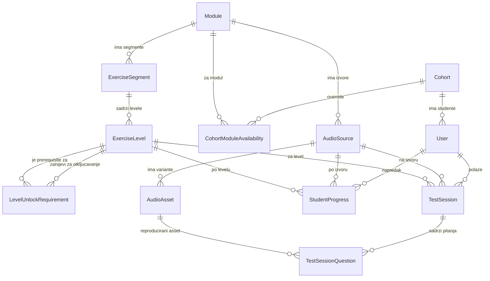
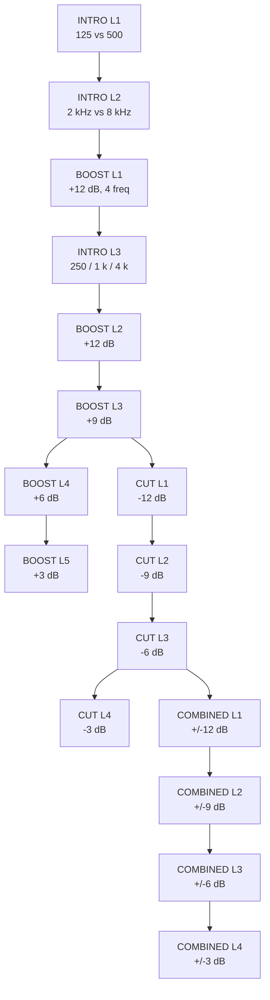

# 02 - Podatkovni model

PostgreSQL preko EF Core 8 / Npgsql. Konvencije:

- Primarni ključevi su `Guid` (`uuid`), generirani na klijentu (`Guid.CreateVersion7()` gdje je bitan poredak umetanja)
- Nazivi tablica i kolona su `snake_case` (paket `EFCore.NamingConventions`, `UseSnakeCaseNamingConvention()`)
- Vremenske oznake su `timestamptz` (`DateTimeOffset` u C#), uvijek UTC
- Konfiguracijska i fleksibilna polja su `jsonb`
- Enumi se u bazi čuvaju kao `int` (stabilne eksplicitne vrijednosti u kodu), ne kao PostgreSQL enum tipovi - dodavanje novog člana ne zahtijeva migraciju tipa
- Brisanje: `OnDelete(DeleteBehavior.Restrict)` za sve reference na konfiguracijske entitete (modul/izvor/level se ne smije obrisati ako postoji napredak); `Cascade` samo `TestSession → TestSessionQuestion`

---

## 1. ER dijagram



Najvažnija posljedica modela: **`StudentProgress` i `TestSession` nose i `AudioSourceId` i `ExerciseLevelId`.** Zato je napredak automatski neovisan po izvoru (EQ/Drums/BOOST L4 i EQ/Vocal/BOOST L2 su dva različita reda), dok konfiguracija levela postoji samo jednom.

---

## 2. Korisnici i cohorti

### Cohort

Generacija studenata, npr. `2025/26`.

| Kolona | Tip | Napomena |
| --- | --- | --- |
| `Id` | `uuid` | PK |
| `Name` | `varchar(50)` | unique, npr. `2025/26` |
| `IsActive` | `bool` | novi korisnici se pri prvoj prijavi dodjeljuju aktivnom cohortu |
| `CreatedAt` | `timestamptz` | |

Filtrirani unique indeks osigurava najviše jedan aktivan cohort:
`HasIndex(c => c.IsActive).IsUnique().HasFilter("is_active")`

### User

| Kolona | Tip | Napomena |
| --- | --- | --- |
| `Id` | `uuid` | PK |
| `EntraObjectId` | `varchar(64)` | unique, `oid` claim iz Entra ID-a - stabilni identitet |
| `Email` | `varchar(256)` | unique, lowercase normalizirano |
| `DisplayName` | `varchar(200)` | |
| `Role` | `int` | `UserRole`: `Student = 0`, `Admin = 1` |
| `CohortId` | `uuid?` | FK → Cohort, nullable (admini nemaju cohort) |
| `CreatedAt` | `timestamptz` | |
| `LastLoginAt` | `timestamptz?` | |

Korisnici se kreiraju just-in-time pri prvoj autentificiranoj requesti (vidi [05-auth.md](05-auth.md)). Nema lokalnih lozinki niti bilo kakvih kredencijala u bazi.

---

## 3. Moduli i dostupnost

### Module

| Kolona | Tip | Napomena |
| --- | --- | --- |
| `Id` | `uuid` | PK |
| `Slug` | `varchar(50)` | unique, `eq` / `compression` - koristi se u URL-ovima |
| `Name` | `varchar(100)` | npr. `Ekvilizacija` |
| `Description` | `varchar(500)` | kratki opis za dashboard |
| `SortOrder` | `int` | |
| `IsEnabledGlobally` | `bool` | glavni prekidač |

Zasebna `ModuleConfig` tablica iz početnog prijedloga nije uvedena - bila bi 1:1 tablica s jednim boolean stupcem. Ako globalna konfiguracija modula naraste, dodaje se `ConfigJson jsonb` kolona na `Module`.

### CohortModuleAvailability

Omogućuje da različite generacije imaju različite module.

| Kolona | Tip | Napomena |
| --- | --- | --- |
| `Id` | `uuid` | PK |
| `CohortId` | `uuid` | FK → Cohort |
| `ModuleId` | `uuid` | FK → Module |
| `IsEnabled` | `bool` | |

Unique indeks: `(CohortId, ModuleId)`.

**Pravilo efektivne dostupnosti:**

```
isAvailable = Module.IsEnabledGlobally
              && (override za (cohort, modul) postoji ? override.IsEnabled : true)
```

Odsutnost override reda znači "naslijedi globalno stanje". Primjer iz specifikacije:

- `2025/26`: EQ enabled, Compression enabled → nema override redova ili oba `true`
- `2026/27`: EQ enabled, Compression disabled → jedan red `(2026/27, compression, false)`

Administratori (`Role = Admin`) vide i koriste sve module neovisno o dostupnosti, jer nemaju cohort.

**Gašenje modula nikada ne briše podatke.** Student ga ne vidi na dashboardu i API vraća `403` za sve njegove endpointe, ali `StudentProgress`, `TestSession` i `TestSessionQuestion` ostaju nedirnuti. Ponovnim uključivanjem napredak se vraća točno onakav kakav je bio.

---

## 4. Audio izvori i assetovi

### AudioSource

| Kolona | Tip | Napomena |
| --- | --- | --- |
| `Id` | `uuid` | PK |
| `ModuleId` | `uuid` | FK → Module |
| `Slug` | `varchar(50)` | `pink-noise`, `drums`, `acoustic-guitar`, `vocal` |
| `Name` | `varchar(100)` | `Ružičasti šum`, `Bubnjevi`, `Akustična gitara`, `Vokal` |
| `SortOrder` | `int` | |
| `IsEnabled` | `bool` | |

Unique indeks: `(ModuleId, Slug)`.

Izvor je **uvijek vezan na modul**. `drums` postoji dvaput - jednom pod EQ, jednom pod Compression - jer su to različiti audio materijali (EQ koristi jedan neutralan snimak, Compression šest gain-matchanih varijanti) i napredak na njima je neovisan. To je ispravno, a ne duplikat.

Compression ima **samo** `drums` i `vocal`. Pink Noise i Acoustic Guitar se ne dodaju.

### AudioAsset

| Kolona | Tip | Napomena |
| --- | --- | --- |
| `Id` | `uuid` | PK - identifikator koji frontend vidi |
| `AudioSourceId` | `uuid` | FK → AudioSource |
| `VariantSlug` | `varchar(50)` | `full` za EQ; `uncompressed`, `light`, `heavy`, `ratio-2`, `ratio-4`, `ratio-12` za Compression |
| `StorageKey` | `varchar(500)` | npr. `compression/drums/ratio-12.mp3` |
| `MimeType` | `varchar(50)` | `audio/flac` (EQ), `audio/mpeg` (Compression) |
| `DurationMs` | `int` | |
| `SampleRate` | `int` | |
| `IntegratedLufs` | `double?` | dokumentacija gain-matchinga, **ne** koristi se za runtime normalizaciju |
| `IsEnabled` | `bool` | |

Unique indeks: `(AudioSourceId, VariantSlug)`.

`StorageKey` je jedina veza s filesystemom i zna je isključivo `IAudioStorage`. Poslovna logika i API rade samo s `AudioAsset.Id`. Detalji u [06-audio.md](06-audio.md).

`IntegratedLufs` postoji da admin može provjeriti jesu li varijante stvarno izjednačene po glasnoći - ako se vrijednosti razlikuju više od tolerancije, kompresija se prepoznaje po glasnoći, a ne po zvuku, i vježba je neispravna.

---

## 5. Vježbe: segmenti i leveli

### ExerciseSegment

| Kolona | Tip | Napomena |
| --- | --- | --- |
| `Id` | `uuid` | PK |
| `ModuleId` | `uuid` | FK → Module |
| `Key` | `varchar(50)` | `boost`, `cut`, `combined`, `detection` |
| `Name` | `varchar(100)` | `Boost`, `Cut`, `Kombinirano`, `Prepoznavanje` |
| `SortOrder` | `int` | |

Unique indeks: `(ModuleId, Key)`.

Segment je tablica, a ne enum, jer progression tree u UI-u iz nje vuče labele i poredak. Frontend ne zna ništa o tome da EQ ima tri segmenta - dobije ih iz API-ja. Compression ima jedan segment (`detection`), što tree svodi na linearan prikaz bez posebnog koda.

### ExerciseLevel

**Ovo je template levela, definiran po modulu - ne po audio izvoru.** EQ ima 13 redova ukupno, Compression 3.

| Kolona | Tip | Napomena |
| --- | --- | --- |
| `Id` | `uuid` | PK |
| `SegmentId` | `uuid` | FK → ExerciseSegment (modul se dobiva kroz segment) |
| `LevelNumber` | `int` | 1-based, unutar segmenta |
| `Title` | `varchar(100)` | npr. `Boost +9 dB` |
| `ExerciseType` | `int` | `ExerciseType` enum, određuje generator pitanja |
| `ConfigJson` | `jsonb` | parametri vježbe, shema ovisi o `ExerciseType` |
| `QuestionCount` | `int` | 14 |
| `PassThreshold` | `int` | 12 - **broj točnih odgovora**, ne postotak |
| `IsEnabled` | `bool` | |

Unique indeks: `(SegmentId, LevelNumber)`.

`QuestionCount` i `PassThreshold` su kolone, a ne konstante u kodu, jer su to parametri vježbe koje admin logično mijenja. Prolaz je **uvijek** `correctAnswers >= PassThreshold` - cjelobrojna usporedba, nikad usporedba postotaka u pomičnom zarezu. Postotak se izračunava samo za prikaz.

### ExerciseType

```csharp
public enum ExerciseType
{
    EqFrequency = 0,              // "Koja je frekvencija promijenjena?"
    EqFrequencyAndDirection = 1,  // "Koja frekvencija i u kojem smjeru?"
    CompressionChoice = 2         // odabir iz konfiguriranih opcija (binarno / količina / ratio)
}
```

Novi tip vježbe znači: novi član enuma + nova implementacija generatora + seed redovi. Nema migracije sheme i nema promjene u test engineu.

### Sheme `ConfigJson`

`EqFrequency` i `EqFrequencyAndDirection`:

```json
{
  "frequenciesHz": [125, 250, 500, 1000, 2000, 4000, 8000],
  "gainsDb": [9],
  "q": 1.0
}
```

- `gainsDb` s jednom pozitivnom vrijednošću = BOOST segment, s jednom negativnom = CUT
- `gainsDb: [12, -12]` = COMBINED: generator slučajno bira smjer, student odgovara i frekvenciju i smjer
- `q` je u konfiguraciji da se može mijenjati bez ikakve promjene koda

`CompressionChoice`:

```json
{
  "options": [
    { "key": "uncompressed", "label": "Nije komprimiran", "variants": ["uncompressed"] },
    { "key": "compressed",   "label": "Komprimiran",      "variants": ["heavy"] }
  ]
}
```

Svaka opcija je jedan mogući odgovor i mapira se na jednu ili više varijanti audio assetа. Generator odabere opciju (balansirano kroz 14 pitanja), zatim slučajno odabere varijantu unutar te opcije. Ista shema pokriva sva tri compression levela; buduća vježba "attack/release" je samo novi config.

Deserializacija: `ConfigJson` se čita u typed recorde (`EqLevelConfig`, `CompressionLevelConfig`) prema `ExerciseType`. Validnost configa provjerava se u seed testu, da neispravan seed pukne u CI-u, a ne pri prvom studentskom testu.

### LevelUnlockRequirement

| Kolona | Tip | Napomena |
| --- | --- | --- |
| `Id` | `uuid` | PK |
| `ExerciseLevelId` | `uuid` | FK → ExerciseLevel - level koji se otključava |
| `RequiredExerciseLevelId` | `uuid` | FK → ExerciseLevel - prerequisite |
| `RequirementType` | `int` | `PassedLevel = 0` |
| `MinScore` | `int?` | opcionalno: minimalni broj točnih; `null` = koristi `PassThreshold` prerequisitea |

Unique indeks: `(ExerciseLevelId, RequiredExerciseLevelId)`.

Semantika:

- **Svi** redovi za jedan level moraju biti zadovoljeni (logički AND)
- **Nula redova znači da je level otključan od početka**
- Uvjet se uvijek evaluira u kontekstu jednog audio izvora: "CUT L1 za Drums" zahtijeva "BOOST L3 prošao za Drums"
- `RequiredExerciseLevelId` mora pripadati istom modulu (provjerava se u seed testu)

Branching nije poseban slučaj u kodu - posljedica je toga da dva reda pokazuju na isti prerequisite. BOOST L3 je prerequisite i za BOOST L4 i za CUT L1, pa jedan prolaz otključava oba.

---

## 6. Napredak studenta

### StudentProgress

| Kolona | Tip | Napomena |
| --- | --- | --- |
| `Id` | `uuid` | PK |
| `UserId` | `uuid` | FK → User |
| `AudioSourceId` | `uuid` | FK → AudioSource |
| `ExerciseLevelId` | `uuid` | FK → ExerciseLevel |
| `BestScore` | `int` | najbolji broj točnih odgovora, nikad postotak |
| `IsPassed` | `bool` | je li level ikad prošao |
| `AttemptCount` | `int` | broj završenih testova |
| `FirstPassedAt` | `timestamptz?` | kad je prvi put prošao |
| `LastAttemptAt` | `timestamptz` | |

Unique indeks: `(UserId, AudioSourceId, ExerciseLevelId)`. Dodatni indeks `(UserId, AudioSourceId)` za dohvat cijelog treea jednim upitom.

Pravila ažuriranja (nakon završenog testa):

```
BestScore     = Max(BestScore, correctAnswers)     // nikad se ne smanjuje
IsPassed      = IsPassed || (correctAnswers >= PassThreshold)
AttemptCount += 1
FirstPassedAt = FirstPassedAt ?? (passed ? now : null)
LastAttemptAt = now
```

**Nema `IsUnlocked` kolone.** Otključanost se izračunava iz `LevelUnlockRequirement` + postojećih `StudentProgress` redova. Razlozi:

1. Promjena unlock pravila odmah vrijedi retroaktivno - nema backfill migracije koja bi morala prepravljati stanje svim studentima
2. Nemoguć je drift između spremljenog `IsUnlocked` i stvarnih pravila
3. Količina podataka je trivijalna: najviše 13 levela po izvoru, dohvaćeno jednim upitom

Red u `StudentProgress` postoji **samo za levele koje je student pokušao**. Nepostojanje reda znači "nula pokušaja", što je ispravno i za zaključane i za otključane a nedirnute levele.

Postotak najboljeg rezultata se ne sprema: `BestScore * 100.0 / QuestionCount`, računa se pri serializaciji.

---

## 7. Test sesije

### TestSession

| Kolona | Tip | Napomena |
| --- | --- | --- |
| `Id` | `uuid` | PK |
| `UserId` | `uuid` | FK → User |
| `AudioSourceId` | `uuid` | FK → AudioSource |
| `ExerciseLevelId` | `uuid` | FK → ExerciseLevel |
| `Status` | `int` | `TestSessionStatus`: `InProgress = 0`, `Completed = 1`, `Abandoned = 2` |
| `StartedAt` | `timestamptz` | |
| `CompletedAt` | `timestamptz?` | |
| `QuestionCount` | `int` | kopija iz levela u trenutku kreiranja |
| `PassThreshold` | `int` | kopija iz levela u trenutku kreiranja |
| `CorrectAnswers` | `int` | 0 dok sesija nije završena |
| `Passed` | `bool` | |
| `RandomSeed` | `int` | za reproducibilnost i debug |

Indeks: `(UserId, ExerciseLevelId, AudioSourceId, Status)` - dohvat aktivne sesije i povijesti.

`QuestionCount` i `PassThreshold` se **kopiraju u sesiju** pri kreiranju. Ako admin promijeni parametre levela dok je test u tijeku, test se dovršava po pravilima koja su vrijedila kad je počeo.

`ScorePercentage` se **ne sprema** - izvedena je vrijednost (`CorrectAnswers * 100.0 / QuestionCount`) i spremanjem bi se samo omogućila nekonzistentnost. Prolaz je uvijek `CorrectAnswers >= PassThreshold`.

Najviše jedna `InProgress` sesija po `(UserId, AudioSourceId, ExerciseLevelId)`; kreiranje nove postojeću označava `Abandoned`.

### TestSessionQuestion

| Kolona | Tip | Napomena |
| --- | --- | --- |
| `Id` | `uuid` | PK |
| `TestSessionId` | `uuid` | FK → TestSession, `OnDelete(Cascade)` |
| `QuestionIndex` | `int` | 1..`QuestionCount` |
| `PromptJson` | `jsonb` | ono što frontend dobije: tekst pitanja, opcije, EQ parametri |
| `CorrectAnswerKey` | `varchar(100)` | **nikad ne izlazi iz backenda prije odgovora** |
| `AudioAssetId` | `uuid?` | FK → AudioAsset |
| `AudioToken` | `uuid` | unique - opaque identifikator za dohvat audija ovog pitanja |
| `StudentAnswerKey` | `varchar(100)?` | |
| `IsCorrect` | `bool?` | `null` = neodgovoreno |
| `AnsweredAt` | `timestamptz?` | |

Unique indeksi: `(TestSessionId, QuestionIndex)` i `AudioToken`.

Sva pitanja jedne sesije generiraju se **odjednom, pri kreiranju sesije**. Time je sesija resumable nakon refresha stranice, randomizacija je jedan zapis u bazu, i ne postoji stanje "sesija bez pitanja".

`AudioToken` je slučajan `Guid` po pitanju. Nema HMAC-a ni expiry logike - token je nepogodiv, vezan na jedno pitanje jedne sesije, i endpoint uz njega provjerava pripada li sesija pozivatelju. To čuva compression varijante skrivenima: frontend nikad ne vidi `ratio-12`, samo token. Obrazloženje i ograničenja u [06-audio.md](06-audio.md).

`CorrectAnswerKey` formati:

- `EqFrequency`: frekvencija u Hz kao string - `"2000"`
- `EqFrequencyAndDirection`: `"2000:boost"` / `"2000:cut"`
- `CompressionChoice`: ključ opcije iz configa - `"ratio-4"`, `"light"`, `"uncompressed"`

Validacija odgovora je usporedba stringova. Svi odgovori su diskretne opcije, pa nije potreban validator po tipu vježbe.

---

## 8. Seed podaci

Seed je dio aplikacije (`Data/Seed/`), idempotentan, izvršava se pri startu ili preko `dotnet run -- seed`. Ključevi (`Slug`, `Key`, `LevelNumber`) su stabilni identifikatori - `Guid`-ovi se generiraju deterministički iz ključeva da ponovni seed ne stvara duplikate.

### Cohorti

`2025/26` (`IsActive = true`).

### Moduli

| Slug | Name | SortOrder | IsEnabledGlobally |
| --- | --- | --- | --- |
| `eq` | Ekvilizacija | 1 | `true` |
| `compression` | Kompresija | 2 | `true` |

### Audio izvori

EQ: `pink-noise` (Ružičasti šum), `drums` (Bubnjevi), `acoustic-guitar` (Akustična gitara), `vocal` (Vokal).
Compression: `drums` (Bubnjevi), `vocal` (Vokal).

### Audio assetovi

EQ - po jedan asset `full` za svaki od četiri izvora, format FLAC (`audio/flac`):

```
eq/pink-noise.flac
eq/drums.flac
eq/acoustic-guitar.flac
eq/vocal.flac
```

Compression - šest varijanti po izvoru, format MP3 320 kbps (`audio/mpeg`):

```
compression/drums/uncompressed.mp3    compression/vocal/uncompressed.mp3
compression/drums/light.mp3           compression/vocal/light.mp3
compression/drums/heavy.mp3           compression/vocal/heavy.mp3
compression/drums/ratio-2.mp3         compression/vocal/ratio-2.mp3
compression/drums/ratio-4.mp3         compression/vocal/ratio-4.mp3
compression/drums/ratio-12.mp3        compression/vocal/ratio-12.mp3
```

`VariantSlug` je dio prije ekstenzije (`ratio-12`), a `StorageKey` je cijeli put s ekstenzijom. Format i obrazloženje su u [06-audio.md](06-audio.md#zahtjevi-za-compression-varijante).

### EQ leveli i unlock pravila

Frekvencije (`all7`): `125, 250, 500, 1000, 2000, 4000, 8000`. `q = 1.0` svugdje.

Segment `intro` (skriven iz studentovog stabla), `ExerciseType = EqFrequency`, `QuestionCount = 6`, `PassThreshold = 0` (završetak uvijek prolazi):

| Level | Naslov | Frekvencije | Zahtijeva |
| --- | --- | --- | --- |
| 1 | 125 Hz ili 500 Hz | 125, 500 | - (otključan od početka) |
| 2 | 2 kHz ili 8 kHz | 2000, 8000 | intro L1 |
| 3 | 250 Hz, 1 kHz ili 4 kHz | 250, 1000, 4000 | boost L1 |

Kartice s mnemotehnikama žive na frontendu; u bazi su samo mini-kvizovi.

Segment `boost`, `ExerciseType = EqFrequency`:

| Level | Gain | Frekvencije | Zahtijeva |
| --- | --- | --- | --- |
| 1 | +12 dB | 125, 500, 2000, 8000 | intro L2 |
| 2 | +12 dB | all7 | intro L3 |
| 3 | +9 dB | all7 | boost L2 |
| 4 | +6 dB | all7 | boost L3 |
| 5 | +3 dB | all7 | boost L4 |

Segment `cut`, `ExerciseType = EqFrequency`:

| Level | Gain | Frekvencije | Zahtijeva |
| --- | --- | --- | --- |
| 1 | -12 dB | all7 | **boost L3** |
| 2 | -9 dB | all7 | cut L1 |
| 3 | -6 dB | all7 | cut L2 |
| 4 | -3 dB | all7 | cut L3 |

Segment `combined`, `ExerciseType = EqFrequencyAndDirection`:

| Level | Gain | Frekvencije | Zahtijeva |
| --- | --- | --- | --- |
| 1 | +/-12 dB | all7 | **cut L3** |
| 2 | +/-9 dB | all7 | combined L1 |
| 3 | +/-6 dB | all7 | combined L2 |
| 4 | +/-3 dB | all7 | combined L3 |

Ukupno 16 EQ levela (13 klasičnih + 3 uvodna) i 15 EQ unlock redova. Studentovo stablo i dalje pokazuje samo 13 klasičnih levela. Cijeli branching tree:



Klasični EQ leveli: `QuestionCount = 20`, `PassThreshold = 16`. Uvodni mini-kvizovi: `QuestionCount = 6`, `PassThreshold = 0`.

Ovaj tree postoji **jednom** u bazi, a evaluira se neovisno za svaki od četiri EQ audio izvora.

### Compression leveli i unlock pravila

Segment `detection`, `ExerciseType = CompressionChoice`, svi `QuestionCount = 14`, `PassThreshold = 12`.

**Level 1** - "Je li signal komprimiran?", zahtijeva: nema (otključan od početka)

```json
{ "options": [
  { "key": "uncompressed", "label": "Nije komprimiran", "variants": ["uncompressed"] },
  { "key": "compressed",   "label": "Komprimiran",      "variants": ["heavy"] }
]}
```

**Level 2** - "Koliko je signal komprimiran?", zahtijeva: L1

```json
{ "options": [
  { "key": "uncompressed", "label": "Nekomprimiran",      "variants": ["uncompressed"] },
  { "key": "light",        "label": "Lagano komprimiran", "variants": ["light"] },
  { "key": "heavy",        "label": "Jako komprimiran",   "variants": ["heavy"] }
]}
```

**Level 3** - "Koji je omjer kompresije?", zahtijeva: L2

```json
{ "options": [
  { "key": "ratio-2",  "label": "2:1",  "variants": ["ratio-2"] },
  { "key": "ratio-4",  "label": "4:1",  "variants": ["ratio-4"] },
  { "key": "ratio-12", "label": "12:1", "variants": ["ratio-12"] }
]}
```

### Seed validacijski testovi

Obavezni u Phase 3, kao zaštita od neispravnog seeda:

- svaki `ConfigJson` se uspješno deserializira u tip koji odgovara `ExerciseType` levela
- svaki `frequenciesHz` sadrži samo dopuštene frekvencije, `gainsDb` samo dopuštene vrijednosti
- `RequiredExerciseLevelId` pripada istom modulu kao `ExerciseLevelId`
- u grafu unlock zahtjeva nema cikla
- svaki modul ima barem jedan level bez zahtjeva (inače je modul nedostupan)
- svaka varijanta navedena u `CompressionChoice` configu ima odgovarajući `AudioAsset` za svaki izvor tog modula
- `PassThreshold <= QuestionCount`
