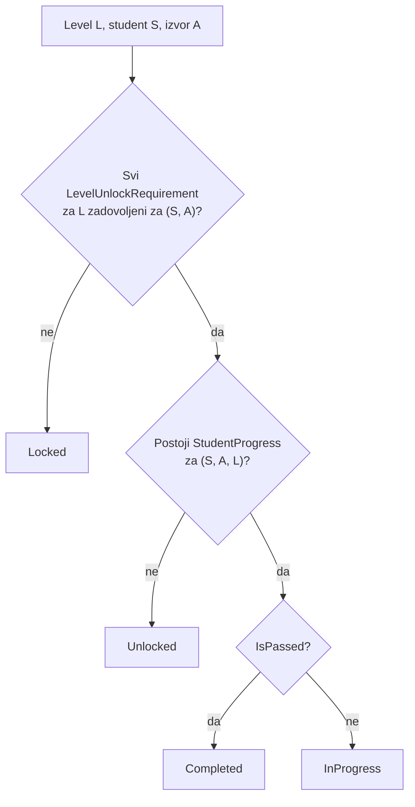

# 03 - Progression i unlock model

Napredak se vodi po kombinaciji **Student → Modul → Audio izvor → Exercise level**. Modul je implicitan jer i audio izvor i level pripadaju modulu.

Sva logika ovog dokumenta je u `Domain/Progression/` kao čiste klase bez EF i ASP.NET ovisnosti, pa je pokrivena unit testovima bez baze.

---

## 1. Neovisnost po audio izvoru

Ključno pravilo: **napredak na jednom audio izvoru ne otključava isti level na drugom izvoru.**

Student može istovremeno imati:

- EQ / Drums / BOOST L4 otključan
- EQ / Vocal / BOOST L2 otključan

To nije poseban slučaj u kodu. Posljedica je toga da je `StudentProgress` ključan po `(UserId, AudioSourceId, ExerciseLevelId)`, a unlock evaluacija uvijek prima `audioSourceId` i gleda samo redove tog izvora. Nema koda koji bi mogao "propustiti" tu izolaciju - nemoguće je napisati upit koji otključava nešto na drugom izvoru jer se izvor filtrira na ulazu.

---

## 2. Stanja levela

```csharp
public enum LevelStatus
{
    Locked = 0,      // zahtjevi nisu zadovoljeni
    Unlocked = 1,    // dostupan, nijedan test još nije završen
    InProgress = 2,  // barem jedan test završen, ali nikad prošao
    Completed = 3    // prošao barem jednom
}
```

Izračun stanja za jedan level, za zadanog studenta i izvor:



Zaključan level može imati `StudentProgress` red samo ako su se unlock pravila promijenila nakon što ga je student odigrao. U tom slučaju stanje je `Locked` (pravila su autoritet), ali `BestScore` se ne briše i vraća se u UI.

---

## 3. Evaluacija unlock zahtjeva

Jedan zahtjev je zadovoljen kad:

```
RequirementType == PassedLevel:
    postoji StudentProgress za (UserId, AudioSourceId, RequiredExerciseLevelId)
    && (MinScore == null
          ? progress.IsPassed
          : progress.BestScore >= MinScore)
```

Level je otključan kad su **svi** njegovi zahtjevi zadovoljeni (AND). **Nula zahtjeva znači otključan od početka.**

Zbog te konvencije ne postoji nikakav "startni level" flag ni hardkodirano `if (segment == boost && level == 1)`. Dva levela u sustavu imaju nula zahtjeva - EQ BOOST L1 i Compression L1 - i to ih čini početnim točkama.

Branching također nije poseban slučaj. BOOST L3 se pojavljuje kao `RequiredExerciseLevelId` u dva reda (za BOOST L4 i za CUT L1), pa jedan prolaz otključava oba. Isto vrijedi za CUT L3 (otključava CUT L4 i COMBINED L1).

Evaluacija je jednoprolazna: zahtjevi referenciraju samo prethodne levele (graf je acikličan, što provjerava seed test), pa nema potrebe za rekurzijom ni topološkim sortiranjem. Dovoljno je:

1. dohvatiti sve levele modula sa zahtjevima (jedan upit, `Include`)
2. dohvatiti sve `StudentProgress` redove za `(UserId, AudioSourceId)` (jedan upit)
3. u memoriji izračunati stanje svakog levela

Dva upita za cijeli tree, neovisno o broju levela.

---

## 4. `ProgressionService`

```csharp
public interface IProgressionService
{
    // Cijeli tree jednog izvora: segmenti, leveli, stanja, najbolji rezultati
    Task<SourceTreeState> GetTreeStateAsync(Guid userId, Guid audioSourceId, CancellationToken ct);

    // Je li konkretan level otključan - poziva se prije kreiranja test sesije
    Task<bool> IsUnlockedAsync(Guid userId, Guid audioSourceId, Guid levelId, CancellationToken ct);

    // Primjena rezultata završenog testa: update napretka + popis novootključanih levela
    Task<ProgressUpdateResult> ApplyTestResultAsync(
        Guid userId, Guid audioSourceId, Guid levelId, int correctAnswers, CancellationToken ct);
}
```

Tipovi rezultata:

```csharp
public record SourceTreeState(
    Guid AudioSourceId,
    string AudioSourceSlug,
    IReadOnlyList<SegmentState> Segments);

public record SegmentState(
    string Key, string Name, int SortOrder,
    IReadOnlyList<LevelState> Levels);

public record LevelState(
    Guid LevelId,
    int LevelNumber,
    string Title,
    LevelStatus Status,
    int BestScore,
    double BestScorePercentage,
    int QuestionCount,
    int PassThreshold,
    int AttemptCount,
    DateTimeOffset? FirstPassedAt,
    IReadOnlyList<Guid> RequiredLevelIds);   // frontend crta veze u treeu

public record ProgressUpdateResult(
    int BestScore,
    bool Passed,
    bool IsFirstPass,
    IReadOnlyList<LevelState> NewlyUnlockedLevels);
```

`RequiredLevelIds` se šalje frontendu da može nacrtati veze u progression treeu iz podataka, bez znanja o EQ strukturi.

`NewlyUnlockedLevels` se izračunava kao razlika stanja treea prije i poslije primjene rezultata - to je izvor teksta "Level 4 otključan" na završnom ekranu. Razlika, a ne "svi otključani", jer student ne treba vidjeti obavijest za levele koje je već imao.

### Čista logika, testabilna bez baze

Sama evaluacija je statička funkcija nad podacima:

```csharp
public static class UnlockEvaluator
{
    public static IReadOnlyDictionary<Guid, LevelStatus> Evaluate(
        IReadOnlyList<LevelDefinition> levels,          // level + njegovi zahtjevi
        IReadOnlyDictionary<Guid, ProgressSnapshot> progress);  // po ExerciseLevelId
}

public static class ScoreRules
{
    public static bool IsPassed(int correctAnswers, int passThreshold)
        => correctAnswers >= passThreshold;

    public static double Percentage(int correctAnswers, int questionCount)
        => questionCount == 0 ? 0 : Math.Round(correctAnswers * 100.0 / questionCount, 1);

    public static int BestScore(int currentBest, int newScore)
        => Math.Max(currentBest, newScore);
}
```

`ProgressionService` je tanki sloj koji dohvaća podatke iz `AppDbContext`, poziva `UnlockEvaluator`/`ScoreRules` i zapisuje rezultat. Sva pravila se testiraju bez EF-a.

---

## 5. Pravila rezultata

**Prolaz je cjelobrojna usporedba:** `correctAnswers >= PassThreshold`. Nikad se ne usporeduju postoci u pomičnom zarezu. Uz `QuestionCount = 14` i `PassThreshold = 12`:

| Rezultat | Postotak (prikaz) | Prolaz |
| --- | --- | --- |
| 11/14 | 78.6% | FAIL |
| 12/14 | 85.7% | PASS |
| 13/14 | 92.9% | PASS |
| 14/14 | 100% | PASS |

Postotak se prikazuje korisniku, ali ne sudjeluje u odluci o prolazu ni u jednoj kodnoj putanji.

**`BestScore` se nikad ne smanjuje.** Ako student napravi 14/14, a kasnije 12/14, `BestScore` ostaje 14. Isto vrijedi za `IsPassed` - jednom prošao, zauvijek prošao; kasniji pad ne zatvara level ni sljedeće levele.

**Zaključan level je nedostupan.** `POST /api/test-sessions` za zaključan level vraća `403` i ne kreira nikakav zapis. Provjera je na serveru; činjenica da frontend taj level prikazuje kao zaključan nije sigurnosna mjera.

---

## 6. Ažuriranje napretka pri završetku testa

Izvršava se u **jednoj transakciji** zajedno sa zaključavanjem sesije, pri zaprimanju zadnjeg odgovora:

1. Izračunaj `correctAnswers` iz `TestSessionQuestion` redova (`COUNT(is_correct = true)`) - **ne** iz bilo čega što je poslao klijent
2. `passed = correctAnswers >= session.PassThreshold`
3. Zapiši `TestSession`: `Status = Completed`, `CompletedAt`, `CorrectAnswers`, `Passed`
4. Upsert `StudentProgress` za `(UserId, AudioSourceId, ExerciseLevelId)` po pravilima iz [02-data-model.md](02-data-model.md#studentprogress)
5. Izračunaj novootključane levele (stanje treea prije vs. poslije)

`PassThreshold` se čita iz **sesije**, ne iz levela, jer je kopiran pri kreiranju - ako admin promijeni prag dok test traje, test se dovršava po pravilima koja su vrijedila na početku.

Idempotentnost: ako je sesija već `Completed`, koraci 3-5 se preskaču i vraća se postojeći rezultat. Dvostruki klik ili retry ne udvostručuje `AttemptCount`.

Konkurentnost: unique indeks na `(UserId, AudioSourceId, ExerciseLevelId)` u `StudentProgress` znači da dvije paralelne završnice ne mogu napraviti dva reda - druga transakcija pada na unique violation i retrya se kao update.

---

## 7. Obavezni testovi (Phase 3)

Ovi testovi su uvjet za završetak Phase 3. Sve osim zadnje dvije skupine su unit testovi bez baze.

### Scoring

- `11/14` → fail
- `12/14` → pass
- `13/14` → pass
- `14/14` → pass
- `0/14` → fail
- kasniji lošiji rezultat ne smanjuje `BestScore`: 14/14 pa 12/14 → `BestScore == 14`
- kasniji lošiji rezultat ne gasi `IsPassed`: 12/14 pa 3/14 → `IsPassed == true`
- prvi prolaz postavlja `FirstPassedAt`, drugi prolaz ga ne mijenja
- `AttemptCount` se povećava za svaki završeni test, i za prolaz i za pad
- postotak: `12/14 == 85.7`, ne sudjeluje u odluci o prolazu

### Unlock

- level bez zahtjeva je `Unlocked` za novog studenta (EQ BOOST L1, Compression L1)
- level sa zahtjevom je `Locked` za novog studenta
- **BOOST L3 pass → CUT L1 otključan**
- **BOOST L3 pass → BOOST L4 otključan** (isti prerequisite, dva levela)
- BOOST L3 fail (11/14) → ni CUT L1 ni BOOST L4 nisu otključani
- **CUT L3 pass → COMBINED L1 otključan**
- CUT L3 pass → CUT L4 otključan
- COMBINED L1 je `Locked` dok CUT L3 nije prošao, čak i ako su svi BOOST leveli prošli
- lanac se ne preskače: prolaz BOOST L1 ne otključava BOOST L3
- Compression: L1 pass → L2 otključan, L2 pass → L3 otključan
- `ApplyTestResultAsync` vraća točno novootključane levele, ne i one koji su već bili otključani

### Izolacija

- **student A napredak ne utječe na studenta B**: A prođe BOOST L3 na Drums → za B je CUT L1 na Drums `Locked`
- **napredak na Drums ne utječe na Vocal**: prolaz BOOST L3 na Drums → CUT L1 na Vocal ostaje `Locked`, CUT L1 na Drums je `Unlocked`
- isti level, dva izvora, dva različita `BestScore` - međusobno se ne prepisuju
- napredak u EQ modulu ne utječe na Compression modul (i kad se izvor zove isto, `drums`)

### Pristup

- kreiranje sesije za zaključan level → `403`, nijedan zapis u bazi
- kreiranje sesije za modul nedostupan cohortu → `403`
- kreiranje sesije za izvor koji ne pripada navedenom modulu → `404`
- gašenje modula ne briše `StudentProgress`; ponovno uključenje vraća isto stanje treea

### Seed (s bazom)

Popis u [02-data-model.md](02-data-model.md#seed-validacijski-testovi): valjanost configa, pripadnost prerequisitea istom modulu, nepostojanje cikla, postojanje potrebnih audio varijanti, `PassThreshold <= QuestionCount`, postojanje barem jednog levela bez zahtjeva po modulu.
