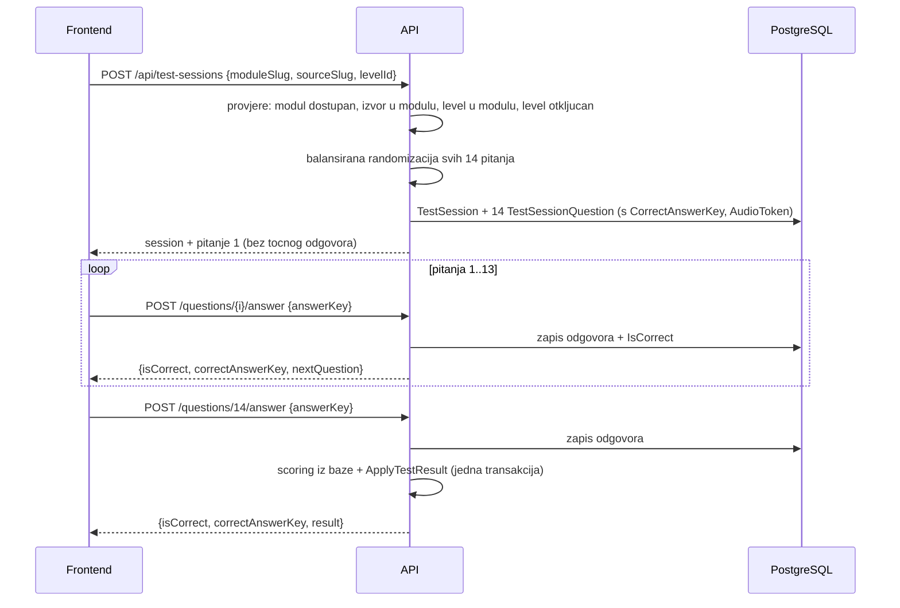

# 04 - REST API

Sve rute su pod `/api`. Svi endpointi zahtijevaju autentikaciju (`Bearer` JWT) osim `/health`.

Konvencije:

- **Slug rute za module i izvore** (`/api/modules/eq/sources/drums/tree`) - čitljive, stabilne, bookmarkable. Guid se koristi za sesije, levele i assetove, gdje je identitet tehnički.
- JSON, `camelCase` (System.Text.Json s `JsonNamingPolicy.CamelCase`)
- Vremena su ISO 8601 UTC
- Greške su `application/problem+json` (RFC 7807)
- Nema paginacije osim na admin listi studenata

---

## 1. Pregled endpointa

### Student

| Metoda | Ruta | Svrha |
| --- | --- | --- |
| GET | `/api/me` | profil, rola, cohort |
| GET | `/api/modules` | dashboard: moduli s dostupnošću i agregatnim napretkom |
| GET | `/api/modules/{moduleSlug}` | detalji modula |
| GET | `/api/modules/{moduleSlug}/sources` | audio izvori modula s agregatnim napretkom |
| GET | `/api/modules/{moduleSlug}/sources/{sourceSlug}/tree` | progression tree sa stanjima i najboljim rezultatima |
| GET | `/api/modules/{moduleSlug}/sources/{sourceSlug}/practice` | konfiguracija practice modea (EQ i Compression) |
| POST | `/api/test-sessions` | kreiranje sesije, vraća prvo pitanje |
| GET | `/api/test-sessions/{sessionId}` | nastavak prekinutog testa ili rezultat |
| POST | `/api/test-sessions/{sessionId}/questions/{index}/answer` | odgovor, vraća feedback i sljedeće pitanje |
| POST | `/api/test-sessions/{sessionId}/abandon` | odustajanje |
| GET | `/api/audio/assets/{assetId}` | audio izvora (EQ test, practice) |
| GET | `/api/audio/questions/{audioToken}` | audio konkretnog pitanja (Compression test) |

### Admin

| Metoda | Ruta | Svrha |
| --- | --- | --- |
| GET | `/api/admin/modules` | moduli s globalnim stanjem i cohort overrideima |
| PUT | `/api/admin/modules/{moduleSlug}` | uključivanje/isključivanje modula globalno |
| GET | `/api/admin/cohorts` | lista cohorta |
| POST | `/api/admin/cohorts` | novi cohort |
| PUT | `/api/admin/cohorts/{cohortId}` | preimenovanje, postavljanje aktivnog |
| PUT | `/api/admin/cohorts/{cohortId}/modules/{moduleSlug}` | cohort-specifična dostupnost |
| GET | `/api/admin/students` | lista studenata (filtriranje po cohortu, paginacija) |
| GET | `/api/admin/students/{userId}/progress` | napredak jednog studenta po modulima i izvorima |

### Razlike od početnog prijedloga

- **`POST /api/test-sessions/{id}/complete` ne postoji.** Sesija se finalizira automatski pri zaprimanju zadnjeg odgovora. Obrazloženje u odjeljku 4.
- **`GET /api/progress` i `GET /api/progress/{moduleId}/{sourceId}` ne postoje.** Napredak nije zaseban resurs - nemoguće ga je pogledati bez konteksta modula i izvora, a taj kontekst je već u `/modules`, `/sources` i `/tree` odgovorima. Tri endpointa koja vraćaju isti podatak znače tri mjesta za neusklađenost.
- **Odgovara se po `questionIndex` (1..14), ne po `questionId`.** Obrazloženje u odjeljku 4.
- Dodani su `/api/me`, `/practice`, `/abandon` i audio endpointi, kojih u početnom prijedlogu nije bilo.

---

## 2. Katalog i napredak

### `GET /api/me`

```json
{
  "id": "0192f0c0-...",
  "email": "ime.prezime@student.algebra.hr",
  "displayName": "Ime Prezime",
  "role": "Student",
  "cohort": { "id": "0192f0c1-...", "name": "2025/26" }
}
```

### `GET /api/modules`

Jedan poziv poslužuje cijeli dashboard. Nedostupni moduli se **vraćaju** s `isAvailable: false` da ih UI može prikazati kao nedostupne, ali bez ikakvih detalja.

```json
{
  "modules": [
    {
      "slug": "eq",
      "name": "Ekvalizacija",
      "description": "Prepoznavanje frekvencijskih promjena",
      "isAvailable": true,
      "sourceCount": 4,
      "levelCount": 13,
      "completedLevelCount": 7,
      "totalLevelCount": 52
    },
    {
      "slug": "compression",
      "name": "Kompresija",
      "description": "Prepoznavanje dinamičke obrade",
      "isAvailable": false,
      "unavailableReason": "NotEnabledForCohort",
      "sourceCount": 2,
      "levelCount": 3,
      "completedLevelCount": 0,
      "totalLevelCount": 6
    }
  ]
}
```

`levelCount` je broj levela u definiciji modula (13 za EQ), a `totalLevelCount` je `levelCount * sourceCount` (52) - to je stvarni broj stvari koje student može završiti, i nazivnik za prikaz napretka.

### `GET /api/modules/{moduleSlug}/sources`

```json
{
  "module": { "slug": "eq", "name": "Ekvalizacija" },
  "sources": [
    { "slug": "pink-noise", "name": "Ružičasti šum",
      "completedLevelCount": 5, "levelCount": 13, "hasPracticeMode": true,
      "isAvailable": true, "unavailableReason": null },
    { "slug": "drums", "name": "Bubnjevi",
      "completedLevelCount": 0, "levelCount": 13, "hasPracticeMode": true,
      "isAvailable": false, "unavailableReason": "IntroRequired" }
  ]
}
```

EQ izvori `drums`, `acoustic-guitar` i `vocal` su zaključani dok student na ružičastom šumu ne završi cijelo upoznavanje s frekvencijama (intro L3). Stablo, practice, intro i test tada vraćaju `403 source-locked`. Kompresija nije pod ovim pravilom.

### `GET /api/modules/{moduleSlug}/sources/{sourceSlug}/tree`

Jedini izvor istine o napretku i otključanosti. Frontend crta tree isključivo iz ovog odgovora - ne zna unaprijed da EQ ima BOOST/CUT/COMBINED. Uvodni EQ segment (`intro`) se ovdje ne vraća; kartice i mini-kvizovi idu preko `/intro`.

```json
{
  "module": { "slug": "eq", "name": "Ekvalizacija" },
  "source": { "slug": "drums", "name": "Bubnjevi" },
  "segments": [
    {
      "key": "boost",
      "name": "Boost",
      "levels": [
        { "levelId": "0192f0d0-...", "levelNumber": 1, "title": "Boost +12 dB (4 frekvencije)",
          "status": "Completed", "bestScore": 14, "bestScorePercentage": 100.0,
          "questionCount": 14, "passThreshold": 12, "attemptCount": 2,
          "firstPassedAt": "2026-03-04T10:12:00Z", "requiredLevelIds": [] },
        { "levelId": "0192f0d1-...", "levelNumber": 2, "title": "Boost +12 dB",
          "status": "InProgress", "bestScore": 10, "bestScorePercentage": 71.4,
          "questionCount": 14, "passThreshold": 12, "attemptCount": 1,
          "firstPassedAt": null, "requiredLevelIds": ["0192f0d0-..."] },
        { "levelId": "0192f0d2-...", "levelNumber": 3, "title": "Boost +9 dB",
          "status": "Locked", "bestScore": 0, "bestScorePercentage": 0,
          "questionCount": 14, "passThreshold": 12, "attemptCount": 0,
          "firstPassedAt": null, "requiredLevelIds": ["0192f0d1-..."] }
      ]
    },
    { "key": "cut", "name": "Cut", "levels": ["..."] },
    { "key": "combined", "name": "Kombinirano", "levels": ["..."] }
  ]
}
```

`requiredLevelIds` omogućuje frontendu da nacrta veze u treeu iz podataka. Zato branching EQ-a ne zahtijeva nikakvu EQ-specifičnu logiku u UI-u, a Compression tree je isti komponenta s jednim segmentom i bez grananja.

### `GET /api/modules/{moduleSlug}/sources/{sourceSlug}/practice`

Practice mode **ne zahtijeva otključan level** - samo dostupnost modula, jer student mora moći slušati prije prvog testa. Ne kreira sesiju, ne bilježi ništa, ne utječe na napredak.

Oba modula imaju practice mode. Oblik odgovora ovisi o modulu, a razlikuje ga polje `mode` - frontend po njemu bira komponentu, bez grananja po slugu modula.

**EQ** (`mode: "eqBand"`):

```json
{
  "module": { "slug": "eq", "name": "Ekvalizacija" },
  "source": { "slug": "drums", "name": "Bubnjevi" },
  "mode": "eqBand",
  "audio": { "assetId": "0192f0e0-...", "url": "/api/audio/assets/0192f0e0-...",
             "durationMs": 12000, "mimeType": "audio/flac" },
  "frequenciesHz": [125, 250, 500, 1000, 2000, 4000, 8000],
  "gainsDb": [12, 9, 6, 3, -3, -6, -9, -12],
  "q": 1.0
}
```

Lista gainova je unija svih gainova konfiguriranih na EQ levelima tog modula, pa se practice automatski širi kad se doda novi level. Isto vrijedi za frekvencije.

**Compression** (`mode: "compressionVariants"`):

```json
{
  "module": { "slug": "compression", "name": "Kompresija" },
  "source": { "slug": "drums", "name": "Bubnjevi" },
  "mode": "compressionVariants",
  "variants": [
    { "variantSlug": "uncompressed", "label": "Nekomprimiran",
      "url": "/api/audio/assets/0192f0e1-...", "durationMs": 10000, "mimeType": "audio/mpeg" },
    { "variantSlug": "light",    "label": "Lagano komprimiran", "url": "/api/audio/assets/0192f0e2-...", "durationMs": 10000, "mimeType": "audio/mpeg" },
    { "variantSlug": "heavy",    "label": "Jako komprimiran",   "url": "/api/audio/assets/0192f0e3-...", "durationMs": 10000, "mimeType": "audio/mpeg" },
    { "variantSlug": "ratio-2",  "label": "2:1",  "url": "/api/audio/assets/0192f0e4-...", "durationMs": 10000, "mimeType": "audio/mpeg" },
    { "variantSlug": "ratio-4",  "label": "4:1",  "url": "/api/audio/assets/0192f0e5-...", "durationMs": 10000, "mimeType": "audio/mpeg" },
    { "variantSlug": "ratio-12", "label": "12:1", "url": "/api/audio/assets/0192f0e6-...", "durationMs": 10000, "mimeType": "audio/mpeg" }
  ]
}
```

Ovdje su nazivi varijanti i labele **namjerno vidljivi** - to je svrha practicea. Ovo je jedino mjesto u API-ju gdje se mapiranje varijante i audija otkriva klijentu; posljedice su dokumentirane u [07-decisions.md](07-decisions.md#odluka-20---practice-mode-otkriva-mapiranje-varijanti).

Redoslijed varijanti je pedagoški, iz `AudioAsset.VariantSlug` poretka definiranog u seedu (od nekomprimiranog prema najagresivnijem), a ne abecedni.

Labele dolaze sa servera, iz iste konfiguracije koja se koristi za odgovore u testu, pa se ne mogu raziđiti s njima.

### `GET /api/modules/{moduleSlug}/sources/{sourceSlug}/intro`

Samo EQ. Vraća audio izvora, Q i tri uvodna mini-kviza (`a1`, `a2`, `b`) sa statusima, plus status BOOST L1/L2. Frontend iz toga vodi kartice i redoslijed; stablo (`/tree`) uvodni segment ne prikazuje.

Kompresija vraća 404.

---

## 3. Test session lifecycle



### `POST /api/test-sessions`

```json
{ "moduleSlug": "eq", "sourceSlug": "drums", "levelId": "0192f0d2-..." }
```

Odgovor `201 Created`:

```json
{
  "sessionId": "0192f100-...",
  "module": { "slug": "eq", "name": "Ekvalizacija" },
  "source": { "slug": "drums", "name": "Bubnjevi" },
  "level": { "levelId": "0192f0d2-...", "segmentKey": "boost",
             "levelNumber": 3, "title": "Boost +9 dB" },
  "questionCount": 14,
  "passThreshold": 12,
  "answeredCount": 0,
  "currentQuestion": { "...": "vidi nize" }
}
```

Ako već postoji `InProgress` sesija za istu kombinaciju `(student, izvor, level)`, ona se označava `Abandoned` i kreira se nova. Stara nikad ne blokira novi pokušaj.

### Oblik pitanja

EQ (`ExerciseType = EqFrequency`):

```json
{
  "questionIndex": 7,
  "questionCount": 14,
  "prompt": "Koja je frekvencija promijenjena?",
  "answerOptions": [
    { "key": "125",  "label": "125 Hz" },
    { "key": "250",  "label": "250 Hz" },
    { "key": "500",  "label": "500 Hz" },
    { "key": "1000", "label": "1 kHz" },
    { "key": "2000", "label": "2 kHz" },
    { "key": "4000", "label": "4 kHz" },
    { "key": "8000", "label": "8 kHz" }
  ],
  "audio": { "url": "/api/audio/assets/0192f0e0-...", "loop": true },
  "eq": { "frequencyHz": 2000, "gainDb": 9, "q": 1.0 }
}
```

EQ (`EqFrequencyAndDirection`) - iste opcije, ali `key` nosi i smjer (`"2000:boost"`, `"2000:cut"`), a `prompt` je "Koja je frekvencija promijenjena i u kojem smjeru?". UI to prikazuje kao dvije skupine kontrola ili 14 tipki, po vlastitom izboru; API ne propisuje raspored.

Compression (`CompressionChoice`):

```json
{
  "questionIndex": 3,
  "questionCount": 14,
  "prompt": "Koji je omjer kompresije?",
  "answerOptions": [
    { "key": "ratio-2",  "label": "2:1" },
    { "key": "ratio-4",  "label": "4:1" },
    { "key": "ratio-12", "label": "12:1" }
  ],
  "audio": { "url": "/api/audio/questions/9f3c1a52-...", "loop": true }
}
```

Compression pitanje **nema** nikakvu informaciju o varijanti - ni naziv fajla, ni asset id, samo token pitanja.

EQ pitanje **ima** `frequencyHz` i `gainDb`, jer bez njih klijent ne može konfigurirati `BiquadFilterNode`. To je neizbježna posljedica realtime EQ-a na klijentu i znači da tehnički potkovan student može pročitati odgovor iz DevToolsa. Odluka i njezine granice su u [07-decisions.md](07-decisions.md#odluka-10---eq-odgovor-je-vidljiv-na-klijentu).

### `POST /api/test-sessions/{sessionId}/questions/{index}/answer`

```json
{ "answerKey": "2000" }
```

Odgovor za pitanja 1-13:

```json
{
  "isCorrect": false,
  "correctAnswerKey": "4000",
  "answeredCount": 7,
  "correctSoFar": 5,
  "nextQuestion": { "...": "pitanje 8" },
  "result": null
}
```

Odgovor za zadnje pitanje:

```json
{
  "isCorrect": true,
  "correctAnswerKey": "2000",
  "answeredCount": 14,
  "correctSoFar": 12,
  "nextQuestion": null,
  "result": {
    "correctAnswers": 12,
    "questionCount": 14,
    "scorePercentage": 85.7,
    "passed": true,
    "isFirstPass": true,
    "newlyUnlockedLevels": [
      { "levelId": "0192f0d3-...", "segmentKey": "boost", "levelNumber": 4, "title": "Boost +6 dB" },
      { "levelId": "0192f0d4-...", "segmentKey": "cut",   "levelNumber": 1, "title": "Cut -12 dB" }
    ]
  }
}
```

Feedback i sljedeće pitanje dolaze u istom odgovoru - jedan roundtrip po pitanju umjesto dva.

**Zašto `questionIndex` a ne `questionId`:** index je predvidiv i jednoznačan, pa server može odbiti odgovor koji ne slijedi redoslijed (`index != answeredCount + 1` → `409`). S `questionId` klijent bi mogao odgovarati u bilo kojem redu ili preskakati pitanja, a resume nakon refresha bi zahtijevao dodatni poziv za "koji je moj id sljedećeg pitanja". Index je istovremeno i pozicija u testu koju UI prikazuje ("Pitanje 7 / 14").

Ponovno odgovaranje na već odgovoreno pitanje vraća `409` i ne mijenja zapis.

### `GET /api/test-sessions/{sessionId}`

Za `InProgress` sesiju vraća isti oblik kao `POST /api/test-sessions` (s `currentQuestion` na prvom neodgovorenom pitanju) - time refresh stranice nastavlja test bez gubitka. Za `Completed` sesiju vraća `result` blok i `currentQuestion: null`.

### Zašto nema `POST /complete`

Zasebni `complete` poziv stvara stanje u kojem su svi odgovori zapisani, ali rezultat nije obračunat. Ako klijent u tom trenutku izgubi mrežu ili korisnik zatvori tab, test je odrađen a napredak izgubljen - i nema ispravnog načina da se to sanira bez pogađanja je li student namjerno prekinuo.

Automatska finalizacija na zadnjem odgovoru nema to stanje: zadnji odgovor i obračun su jedna transakcija, atomarno. Klijent ne mora ništa dodatno pozvati, ne može zaboraviti, i ne može utjecati na rezultat. Rezultat je i dalje dostupan preko `GET /api/test-sessions/{id}` koliko puta treba.

`POST /api/test-sessions/{sessionId}/abandon` pokriva stvarni slučaj prekida - označava sesiju `Abandoned`, bez obračuna i bez utjecaja na `AttemptCount`.

---

## 4. Audio endpointi

### `GET /api/audio/assets/{assetId}`

Za EQ test, EQ practice i Compression practice. Zahtijeva autentikaciju i dostupnost modula kojem asset pripada. Koristi se svugdje gdje asset id ne odaje odgovor: kod EQ-a je izvor studentov odabir, a u Compression practiceu su labele varijanti namjerno vidljive.

Odgovor: `200` s audio streamom, `Accept-Ranges: bytes`, `ETag`, `Cache-Control: private, max-age=604800, immutable`. Dugi cache je namjeran: jedan EQ izvor se skine jednom i koristi kroz cijeli test i practice.

### `GET /api/audio/questions/{audioToken}`

Za Compression test. Server iz tokena razriješi pitanje → sesiju → asset, provjeri da sesija pripada pozivatelju, i streama.

Odgovor: `200` s `Cache-Control: no-store`. Bez cachea namjerno - vidi [06-audio.md](06-audio.md#4-zašto-token-po-pitanju-i-bez-cachea).

Oba endpointa podržavaju `Range` requeste, što je potrebno za `<audio>` element i seek.

---

## 5. Admin endpointi

### `GET /api/admin/modules`

```json
{
  "modules": [
    {
      "slug": "eq", "name": "Ekvalizacija", "isEnabledGlobally": true,
      "cohortOverrides": [
        { "cohortId": "0192f0c1-...", "cohortName": "2025/26", "isEnabled": true }
      ]
    }
  ]
}
```

### `PUT /api/admin/modules/{moduleSlug}`

```json
{ "isEnabledGlobally": false }
```

Odgovor uključuje broj pogođenih studenata, da admin vidi posljedicu prije potvrde u UI-u. Napredak se ne briše.

### `PUT /api/admin/cohorts/{cohortId}/modules/{moduleSlug}`

```json
{ "isEnabled": false }
```

Upsert `CohortModuleAvailability` reda. `null` u tijelu (`{ "isEnabled": null }`) briše override i vraća modul na naslijeđeno globalno stanje.

### `GET /api/admin/students?cohortId=&search=&page=1&pageSize=50`

```json
{
  "page": 1, "pageSize": 50, "totalCount": 84,
  "students": [
    { "userId": "0192f0f0-...", "email": "ime.prezime@student.algebra.hr",
      "displayName": "Ime Prezime", "cohortName": "2025/26",
      "lastLoginAt": "2026-03-04T09:55:00Z",
      "completedLevelCount": 9, "totalLevelCount": 58 }
  ]
}
```

### `GET /api/admin/students/{userId}/progress`

Napredak po modulima i izvorima, ista struktura kao studentski `tree` endpoint, ali za svih šest kombinacija modul/izvor u jednom odgovoru.

---

## 6. Model greške

Sve greške su `application/problem+json`:

```json
{
  "type": "https://cll.algebra.hr/errors/level-locked",
  "title": "Level nije otključan",
  "status": 403,
  "detail": "Level 'Cut -12 dB' zahtijeva prolaz levela 'Boost +9 dB' na ovom audio izvoru.",
  "instance": "/api/test-sessions"
}
```

| Status | Kada |
| --- | --- |
| `400` | neispravan oblik zahtjeva, `answerKey` nije među ponuđenim opcijama |
| `401` | nema tokena ili je token nevažeći |
| `403` | e-mail domena nije dopuštena, modul nedostupan, level zaključan, sesija nije pozivateljeva, admin ruta bez admin role |
| `404` | modul/izvor/level/sesija/asset ne postoji, ili izvor ne pripada navedenom modulu |
| `409` | pitanje je već odgovoreno, odgovor nije po redu, sesija nije `InProgress` |
| `500` | neočekivano; detalji se logiraju, klijentu se ne šalju |

`403` se koristi i za "sesija nije tvoja" iako bi `404` skrivao postojanje - vlasništvo sesije nije tajna koju treba skrivati, a jasna greška pomaže pri debugiranju.

---

## 7. Sigurnosne provjere

Frontend se **ne** smatra pouzdanim. Student može otvoriti DevTools, mijenjati zahtjeve i pozivati endpointe direktno. Svaki zahtjev prolazi primjenjive provjere sa liste:

**Identitet**

1. Token je validan, izdan za ovaj API (`aud`), iz Algebrinog tenanta (`iss`, `tid`)
2. E-mail domena je na allow-listi (`algebra.hr`, `student.algebra.hr`)
3. `User` red postoji ili se kreira JIT; `Role` se čita **iz baze**, nikad iz klijentskog zahtjeva

**Pristup sadržaju**

4. Modul postoji i `IsEnabledGlobally`
5. Modul je dostupan cohortu pozivatelja (osim za admine)
6. Audio izvor pripada navedenom modulu
7. Level pripada navedenom modulu (kroz segment)
8. Level je otključan za `(pozivatelj, izvor)` - provjerava `IProgressionService`, ne klijent
9. Admin rute zahtijevaju `Role = Admin` iz baze

Practice endpoint svjesno **preskače** provjeru 8 (nema level u kontekstu), ali prolazi provjere 4-7. Nedostupan modul znači nedostupan practice.

**Test sesija**

10. `TestSession.UserId == pozivatelj.Id`
11. `TestSession.Status == InProgress` za sve operacije odgovaranja
12. Pitanje s danim `questionIndex` postoji u toj sesiji
13. Pitanje **nije** već odgovoreno
14. `questionIndex == answeredCount + 1` (redoslijed se ne preskače)
15. `answerKey` je jedan od `answerOptions` tog pitanja
16. `CorrectAnswerKey` se ne serializira ni u jednom odgovoru prije nego što je pitanje odgovoreno

**Rezultat**

17. `correctAnswers` se računa iz baze (`COUNT` nad `TestSessionQuestion`), nikad iz klijentskog podatka
18. Prolaz je `correctAnswers >= session.PassThreshold`, iz sesije
19. Ažuriranje napretka radi isključivo server, u istoj transakciji kao finalizacija
20. Finalizacija je idempotentna - ponovni poziv ne mijenja rezultat ni `AttemptCount`

**Audio**

21. `GET /api/audio/assets/{id}` provjerava dostupnost modula kojem asset pripada
22. `GET /api/audio/questions/{token}` provjerava da sesija pitanja pripada pozivatelju
23. `StorageKey` se ne pojavljuje ni u jednom API odgovoru

Ne postoji endpoint koji prima rezultat, score, `passed` ili unlock stanje od klijenta. Najviše što napadač s DevToolsima može učiniti je odgovoriti na pitanja - što je i cilj aplikacije - uz izuzetak EQ-a opisan u [07-decisions.md](07-decisions.md#odluka-10---eq-odgovor-je-vidljiv-na-klijentu).

---

## 8. Integracijski testovi (Phase 5)

Preko `WebApplicationFactory` s test bazom i lažnim autentikacijskim handlerom:

- neautentificiran zahtjev na svaki endpoint → `401`
- e-mail izvan dopuštenih domena → `403`
- student na admin ruti → `403`
- kreiranje sesije za zaključan level → `403`, `TestSession` tablica ostaje prazna
- kreiranje sesije za modul isključen cohortu → `403`
- izvor drugog modula u ruti (`/api/modules/compression/sources/pink-noise/tree`) → `404`
- sesija drugog studenta → `403`
- pitanje odgovoreno dvaput → `409`, zapis nepromijenjen
- odgovor na pitanje 5 kad je odgovoreno 3 → `409`
- `answerKey` koji nije u opcijama → `400`
- nijedan odgovor API-ja na neodgovoreno pitanje ne sadrži `correctAnswerKey` (provjera nad raw JSON-om)
- nijedan odgovor API-ja ne sadrži `storageKey` ni naziv varijante za Compression pitanja (provjera nad raw JSON-om)
- puni prolaz kroz 14 pitanja: rezultat, prolaz, `newlyUnlockedLevels`, stanje treea nakon testa
- refresh usred testa (`GET /api/test-sessions/{id}`) vraća točno prvo neodgovoreno pitanje
- druga sesija za isti level označava prvu `Abandoned`
- practice endpoint radi bez ijednog otključanog levela (novi student), ali vraća `403` za nedostupan modul
- practice poziv ne kreira `TestSession` ni `StudentProgress` red
- EQ practice vraća `mode: "eqBand"`, Compression practice `mode: "compressionVariants"` sa svih 6 varijanti u seed poretku
