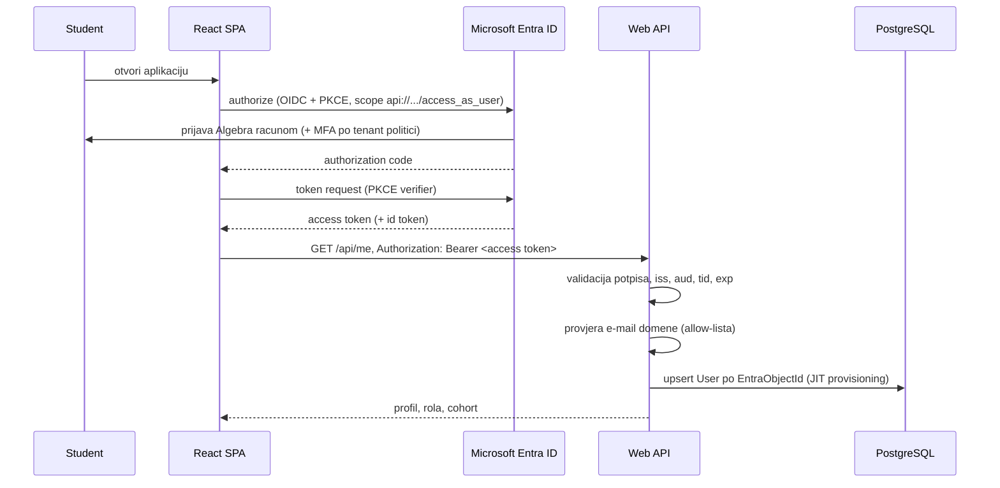

# 05 - Autentikacija i autorizacija

Studenti se prijavljuju svojim Algebra računom preko Microsoft Entra ID-a. Aplikacija ne čuva lozinke ni bilo kakve kredencijale.

> **Trenutni status:** app registracije u Algebrinom tenantu još ne postoje i tek se traže. Razvoj ide s dev bypassom (odjeljak 6), a Entra grana se implementira do kraja ali ostaje neprovjerena do dobivanja registracija. Popis podataka koje treba zatražiti je u odjeljku 2.

---

## 1. Tok prijave



Frontend koristi `@azure/msal-browser` / `@azure/msal-react` s **Authorization Code + PKCE** tokom (bez client secreta, kako i treba za SPA). Tokeni se drže u MSAL cacheu (`sessionStorage`), osvježavaju se silent refreshom, i prilažu se svakom API zahtjevu kroz jedan interceptor u `src/api/`.

---

## 2. Entra ID konfiguracija

Potrebne su **dvije app registracije** u Algebrinom tenantu:

**API** (`CriticalListeningLab-Api`)

- Expose an API → Application ID URI `api://<api-client-id>`
- Scope: `access_as_user`, admin consent nije potreban, korisnik ga odobrava pri prijavi
- Nema redirect URI-jeva, nema secreta (API samo validira tokene)

**SPA** (`CriticalListeningLab-Web`)

- Platform: Single-page application
- Redirect URI: `http://localhost:5173` (dev), produkcijski URL
- API permissions → `api://<api-client-id>/access_as_user`
- Nema client secreta

Backend konfiguracija:

```jsonc
"AzureAd": {
  "Instance": "https://login.microsoftonline.com/",
  "TenantId": "<algebra-tenant-id>",
  "ClientId": "<api-client-id>",
  "Audience": "api://<api-client-id>"
}
```

Registracija je **single-tenant** (`TenantId` je konkretan, ne `common`) - računi iz drugih tenanta ne mogu dobiti token ni pokušati prijavu.

Validira se: potpis, `iss` (Algebra tenant), `aud` (naš API), `tid`, `exp`/`nbf`, i `scp` sadrži `access_as_user`.

### Što zatražiti od tenant administratora

Konkretan popis, jer registracije još ne postoje:

1. Dvije app registracije u Algebrinom tenantu: `CriticalListeningLab-Api` i `CriticalListeningLab-Web`
2. Na API registraciji: Application ID URI `api://<api-client-id>` i izložen delegated scope `access_as_user` (bez potrebe za admin consentom)
3. Na SPA registraciji: platforma **Single-page application**, redirect URI za razvoj (`http://localhost:5173`) i kasnije za produkciju, te API permission na `api://<api-client-id>/access_as_user`
4. Povratno su nam potrebni: `TenantId`, oba `ClientId`-a. **Client secret nije potreban ni za jednu registraciju** - SPA koristi PKCE, a API samo validira tokene.
5. Potvrda da studentski računi (`@student.algebra.hr`) i nastavnički (`@algebra.hr`) pripadaju istom tenantu; ako ne, treba nam `TenantId` obaju i registracija postaje multi-tenant s eksplicitnom listom dopuštenih tenanta

Dok se to ne dobije, aplikacija radi s dev bypassom i **nijedan** drugi dio sustava ne čeka na ovu informaciju.

---

## 3. Allow-lista e-mail domena

Single-tenant registracija već ograničava prijavu na Algebrin tenant, ali domenska provjera je druga, eksplicitna granica - tenant može sadržavati i goste ili račune drugih domena.

Dopuštene domene (u konfiguraciji, ne u kodu):

```jsonc
"Auth": { "AllowedEmailDomains": ["algebra.hr", "student.algebra.hr"] }
```

E-mail se čita iz claimova u ovom redoslijedu: `preferred_username` → `email` → `upn`. Prvi koji izgleda kao e-mail adresa se normalizira (trim, lowercase) i njegova domena se usporeduje s listom. Usporedba je egzaktna nad cijelom domenom - `algebra.hr.napadac.com` ne prolazi, a poddomene koje nisu na listi također ne prolaze.

Ako domena nije dopuštena, zahtjev se odbija s `403` i **korisnik se ne kreira u bazi**. Sve što je potrebno za tu odluku dostupno je iz tokena, bez upita u bazu.

---

## 4. JIT provisioning korisnika

Nema registracije ni pozivnica. Pri prvom autentificiranom zahtjevu:

1. Pročitaj `oid` claim (stabilni Entra object id - ne mijenja se pri promjeni imena ili e-maila)
2. Nađi `User` po `EntraObjectId`
3. Ako ne postoji, kreiraj:
   - `Email` = normalizirani e-mail iz tokena
   - `DisplayName` = `name` claim
   - `Role` = `Admin` ako je e-mail na `Auth:AdminEmails` listi, inače `Student`
   - `CohortId` = `Id` cohorta s `IsActive = true` (`null` ako aktivnog nema ili je korisnik admin)
4. Ako postoji, osvježi `Email`, `DisplayName` i `LastLoginAt` ako su se promijenili

`EntraObjectId` je identitet, ne e-mail. Promjena e-maila studenta (npr. promjena prezimena) ne stvara novog korisnika i ne gubi napredak.

Implementacija je `IClaimsTransformation` ili middleware koji nakon uspješne validacije tokena obavi upsert i doda domenske claimove (`app:userId`, `app:role`, `app:cohortId`) u `ClaimsPrincipal`. Upsert je idempotentan, a `LastLoginAt` se osvježava najviše jednom po sesiji (throttle na razini tokena) da se ne piše u bazu pri svakom zahtjevu.

---

## 5. Role i autorizacija

```csharp
public enum UserRole { Student = 0, Admin = 1 }
```

**Rola je u bazi** (`User.Role`), ne u Entra App Roles. Razlozi:

- ne ovisimo o tome imamo li pravo konfigurirati app roles i dodjeljivati ih u Algebrinom tenantu (to je često pravo koje ima samo tenant administrator)
- promjena role je `UPDATE` u bazi, vidljiva odmah, bez čekanja novog tokena
- broj admina je mali i rijetko se mijenja

Bootstrap prvog admina: `Auth:AdminEmails` lista u konfiguraciji. Korisnik s tim e-mailom dobiva `Admin` rolu pri JIT provisioningu. Lista se **ne** provjerava pri svakom zahtjevu - rola iz baze je autoritet nakon kreiranja, pa uklanjanje s liste ne skida postojeću rolu (to se radi kroz bazu/admin UI).

Ako se kasnije pokaže da role treba upravljati centralno iz Entra ID-a, prelazak je zamjena jednog koraka u claims transformaciji (čitanje `roles` claima umjesto kolone), bez promjene policyja ni endpointa.

### Policyji

```csharp
options.AddPolicy("RequireStudent", p => p.RequireAuthenticatedUser()
    .RequireClaim("app:role", "Student", "Admin"));
options.AddPolicy("RequireAdmin",   p => p.RequireAuthenticatedUser()
    .RequireClaim("app:role", "Admin"));
```

Admin prolazi i kroz `RequireStudent` - može koristiti studentske ekrane za provjeru sadržaja.

Fallback policy je `RequireAuthenticatedUser()`, pa je **svaki** endpoint zaštićen po defaultu. Javni su samo eksplicitno označeni: `/health` i `/api/health`.

### Autorizacija sadržaja

Policyji pokrivaju samo "smije li ovaj tip korisnika na ovu rutu". Provjere "smije li **ovaj** korisnik **ovaj** sadržaj" nisu u policyjima nego u servisima, jer zahtijevaju upite u bazu:

- `IModuleAccessService.EnsureAvailableAsync(user, moduleSlug)` - globalna i cohort dostupnost; `403` ako nije dostupno. Admin uvijek prolazi.
- `IProgressionService.IsUnlockedAsync(userId, sourceId, levelId)` - otključanost levela; `403` ako nije otključan.
- Vlasništvo sesije se provjerava u handleru (`session.UserId == currentUser.Id`).

Puni popis provjera je u [04-api.md](04-api.md#7-sigurnosne-provjere).

---

## 6. Dev bypass

Razvoj backenda i frontenda ne smije ovisiti o tome je li app registracija u Algebrinom tenantu spremna - a trenutno nije, pa je bypass jedini funkcionalni put do prvog pravog logina.

```jsonc
"Auth": {
  "UseDevBypass": true,
  "DevUser": {
    "Email": "dev.student@student.algebra.hr",
    "DisplayName": "Dev Student",
    "Role": "Student"
  }
}
```

Kad je uključen, registrira se `DevAuthenticationHandler` kao default shema. On:

- prihvaća svaki zahtjev kao autentificiran
- gradi `ClaimsPrincipal` iz `Auth:DevUser` konfiguracije
- prolazi kroz **istu** JIT provisioning i domensku provjeru kao pravi tok, pa se dev korisnik stvarno kreira u bazi i ponaša identično pravom

Time se ista kodna putanja izvršava u dev i produkciji - bypass zamjenjuje samo izvor identiteta, ne logiku oko njega. Praktična posljedica: kad registracije dođu, neprovjeren ostaje samo jedan sloj (validacija tokena), a ne cijeli autorizacijski put.

### Prelazak na pravi Entra tok

Kad registracije budu dostupne, potrebno je samo:

1. upisati `AzureAd:TenantId` i `AzureAd:ClientId` (API), te `VITE_ENTRA_*` varijable (SPA)
2. postaviti `Auth:UseDevBypass = false`
3. prijaviti se jednim `@algebra.hr` i jednim `@student.algebra.hr` računom i provjeriti da su `User` redovi ispravno kreirani

Nema promjene koda. Ako prijava padne, greška je u konfiguraciji registracije (audience, scope, redirect URI), a ne u aplikaciji.

Prebacivanje role u dev okolini: promjena `Auth:DevUser:Role` na `Admin` (ili header `X-Dev-Role: Admin` koji handler čita **samo** kad je bypass uključen), radi testiranja admin ekrana bez druge registracije.

### Zaštita

- `UseDevBypass` se čita samo iz konfiguracije, nikad iz zahtjeva
- Ako je `ASPNETCORE_ENVIRONMENT == Production` i `UseDevBypass == true`, **aplikacija odbija startati** s eksplicitnom greškom. Bolje je da deploy padne nego da produkcija radi bez autentikacije.
- `appsettings.json` (osnovni, koji ide u deploy) ima `"UseDevBypass": false`; `true` postoji samo u `appsettings.Development.json` i lokalnim user secretsima
- Frontend ima ekvivalent (`VITE_USE_DEV_AUTH`) koji preskače MSAL i ne prilaže `Authorization` header

---

## 7. Cohort dodjela

Novi korisnik pri prvoj prijavi dobiva cohort koji ima `IsActive = true`. Filtrirani unique indeks na toj koloni garantira da aktivan cohort može biti samo jedan, pa dodjela nije ambiciozna.

Ako aktivnog cohorta nema, korisnik se kreira s `CohortId = null`. Takav student vidi module prema **globalnoj** dostupnosti (nema cohorta pa nema overridea) i može normalno raditi - admin ga kasnije dodijeli. Alternativa je blokirati ga do dodjele, što bi na početku semestra značilo da prvi studenti ne mogu ući u aplikaciju; blaži default je bolji.

Admin mijenja cohort studenta i postavlja aktivni cohort kroz admin ekrane (Phase 9). Promjena cohorta mijenja **dostupnost modula**, ali nikad ne dira `StudentProgress` - napredak je vezan na korisnika, ne na cohort.

---

## 8. Ostalo

**CORS**: allow-lista originâ iz `Cors:AllowedOrigins`, s `AllowCredentials()` isključenim (koristimo Bearer tokene, ne cookieje). Dev: `http://localhost:5173`.

**HTTPS**: obavezan u produkciji (`UseHsts`, `UseHttpsRedirection`).

**Odjava**: MSAL `logoutRedirect` čisti lokalni cache i odjavljuje iz Entra sesije. Backend nema stanje sesije koje treba čistiti.

**Logiranje**: `EntraObjectId` i e-mail se logiraju samo na `Information` razini pri prijavi. Access tokeni se **nikad** ne logiraju.

**Testovi (Phase 2 i 5)**:

- zahtjev bez tokena → `401`
- token s nedopuštenom domenom → `403`, korisnik nije kreiran u bazi
- token s dopuštenom domenom → korisnik kreiran, rola `Student`, cohort = aktivni cohort
- druga prijava istog `oid` s promijenjenim e-mailom → isti `User` red, osvježen e-mail, napredak sačuvan
- e-mail na `AdminEmails` listi → rola `Admin`
- student na admin ruti → `403`
- `UseDevBypass = true` u Production okolini → aplikacija ne startuje
