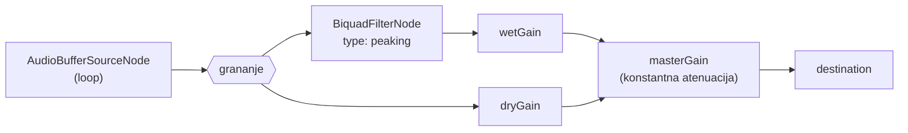

# 06 - Audio: storage, dostava i engine

Dva bitno različita pristupa u dva modula:

- **EQ** - jedan neutralan snimak po izvoru, obrada je **realtime na klijentu** preko Web Audio API-ja
- **Compression** - unaprijed renderirane, gain-matchane varijante pripremljene u DAW-u, klijent samo reproducira

EQ se **ne** renderira unaprijed. Jedan EQ test ima 14 pitanja, a kombinacija 7 frekvencija × 8 gainova × 4 izvora bila bi 224 fajla, uz nemogućnost practice modea sa slobodnim mijenjanjem parametara.

---

## 1. Storage abstrakcija

Poslovna logika i API znaju samo `AudioAsset.Id`. Put do fajla postoji isključivo u `AudioAsset.StorageKey`, a razrješava ga jedino `IAudioStorage`.

```csharp
public interface IAudioStorage
{
    Task<AudioDelivery> GetAsync(string storageKey, CancellationToken ct);
}

// Jedan od dva načina dostave, ovisno o provideru
public abstract record AudioDelivery
{
    // Lokalno: stream koji controller prosljeđuje klijentu
    public sealed record Stream(System.IO.Stream Content, string MimeType,
                               long Length, string ETag) : AudioDelivery;

    // Udaljeno: presigned URL na koji controller radi 302 redirect
    public sealed record Redirect(string Url, TimeSpan ExpiresIn) : AudioDelivery;
}
```

Implementacije:

| Provider | Klasa | Ponašanje |
| --- | --- | --- |
| `Local` | `LocalFileAudioStorage` | čita `{LocalRoot}/{storageKey}`, vraća `Stream` |
| `R2` | `R2AudioStorage` | generira presigned URL (S3-kompatibilni API), vraća `Redirect` |

Odabir preko konfiguracije, bez promjene ostatka aplikacije:

```jsonc
"AudioStorage": { "Provider": "Local", "LocalRoot": "wwwroot/audio" }
```

Controller obraduje oba slučaja jednako za sve endpointe:

```csharp
return delivery switch
{
    AudioDelivery.Stream s   => File(s.Content, s.MimeType, enableRangeProcessing: true),
    AudioDelivery.Redirect r => Redirect(r.Url),
    _ => throw new UnreachableException()
};
```

**Prelazak na Cloudflare R2 je: nova klasa koja implementira `IAudioStorage`, promjena `AudioStorage:Provider` u konfiguraciji, i upload fajlova.** Ni jedan entitet, endpoint, DTO ni frontend komponenta se ne mijenja. `StorageKey` vrijednosti ostaju iste jer su relativni putovi koji jednako dobro opisuju lokalni direktorij i R2 bucket.

`LocalFileAudioStorage` mora normalizirati put i odbiti sve što izlazi iz `LocalRoot` (path traversal), iako `StorageKey` dolazi iz baze a ne od korisnika.

---

## 2. Struktura i priprema fajlova

### Konvencija `StorageKey`

```
eq/pink-noise.flac
eq/drums.flac
eq/acoustic-guitar.flac
eq/vocal.flac

compression/drums/uncompressed.mp3
compression/drums/light.mp3
compression/drums/heavy.mp3
compression/drums/ratio-2.mp3
compression/drums/ratio-4.mp3
compression/drums/ratio-12.mp3

compression/vocal/... (isto)
```

Nazivi su čitljivi u storageu jer tamo nisu problem - klijent ih nikada ne vidi (vidi odjeljak 4).

### Zahtjevi za EQ izvore

- Format: **FLAC** (`audio/flac`), 44.1 kHz, 24 bit, stereo
- Trajanje: 8-15 s, glazbeni materijal koji se može petljati (loop) bez čujnog šava
- Sadržaj: neutralan, bez izražene EQ obrade - vježba mjeri prepoznavanje **dodane** promjene
- **Peak normaliziran na približno -18 dBFS.** To je headroom zahtjev: uz +12 dB boost i konstantnu master atenuaciju od -12 dB (odjeljak 6), signal ostaje ispod 0 dBFS bez clippinga
- Pink noise generiran ili renderiran na istu razinu kao ostali izvori

FLAC je odabran jer je lossless, a fajl je oko 50-60% veličine WAV-a. Kod EQ-a je losslessnost bitna jer se na signal primjenjuje filtar u realnom vremenu, pa bi kodek artefakti ulazili u obradu. Izvor se skine jednom po audio izvoru i dugotrajno cachira, pa je manja veličina čista ušteda.

**Provjera podrške (prvi korak Phase 7):** FLAC dekodiranje kroz `decodeAudioData` podržavaju svi ciljani preglednici (Chrome/Edge od v56, Firefox od v51, Safari od v11), ali podrška za FLAC u Web Audio kontekstu bila je povijesno neujednačenija od MP3-a. Prije bilo kojeg rada na engineu provjeriti dekodiranje pravog fajla na Chrome, Firefox, Edge i Safari. Ako neki ciljani preglednik padne, fallback je WAV za taj izvor - `MimeType` i `StorageKey` su podaci u bazi, pa zamjena ne dira kod.

### Zahtjevi za Compression varijante

- Format: MP3 320 kbps ili AAC 256 kbps (obrazloženje u odjeljku 4), 44.1 kHz, stereo
- Trajanje: **približno 10 s**, sve varijante jednog izvora **identičnog trajanja i identičnog isječka** - razlika smije biti samo u kompresiji
- Isti početak i kraj (sample-accurate), inače student prepoznaje varijantu po tome gdje ulazi bubanj
- **Varijante moraju biti gain-matchane prije importa u aplikaciju.** Ovo je najvažniji zahtjev cijelog modula: ako je komprimirana verzija glasnija, student ne uči prepoznavati kompresiju nego glasnoću. Izjednačiti po integriranom LUFS-u, tolerancija **±0.5 LU**, i provjeriti slušanjem A/B.
- Izmjerene LUFS vrijednosti se upisuju u `AudioAsset.IntegratedLufs` da se odstupanje može provjeriti bez ponovnog mjerenja
- Kompresija mora biti stvarno različita između varijanti (`light` vs `heavy`, te 2:1 / 4:1 / 12:1 s istim thresholdom i makeup gainom podešenim na izjednačenu glasnoću), inače je level nerješiv

**Aplikacija ne radi nikakvu normalizaciju ni loudness matching u pregledniku.** Master gain je konstantan i identičan za sve varijante. Svaka runtime normalizacija bi uništila upravo onu razliku koju vježba mjeri, ili bi uvela novu razliku koje u fajlovima nema.

### Seed provjera

Phase 3 seed test provjerava da za svaku varijantu navedenu u `CompressionChoice` configu postoji `AudioAsset` red za svaki izvor tog modula. Phase 8 dodaje provjeru da fajlovi stvarno postoje na storageu i da im se `DurationMs` poklapa unutar izvora.

---

## 3. Dostava audija

Dva endpointa, opisana u [04-api.md](04-api.md#4-audio-endpointi):

**`GET /api/audio/assets/{assetId}`** - EQ test, EQ practice i Compression practice.
Koristi se svugdje gdje asset id ne odaje odgovor: kod EQ-a je izvor studentov odabir, a kod Compression practicea su labele varijanti namjerno vidljive. Dugotrajni cache (`private, max-age=604800, immutable`, `ETag`) - jedan EQ izvor se skine jednom i koristi kroz cijeli test i practice.

**`GET /api/audio/questions/{audioToken}`** - Compression test.
Token je slučajan `Guid` iz `TestSessionQuestion.AudioToken`. Server razriješi token → pitanje → sesiju → asset, provjeri da sesija pripada pozivatelju, i streama s `Cache-Control: no-store`.

Oba podržavaju `Range` requeste (`enableRangeProcessing: true`), što `<audio>` element i `fetch` + `decodeAudioData` očekuju.

---

## 4. Zašto token po pitanju i bez cachea

Compression Level 3 pita "koji je omjer kompresije". Ako klijent dobije URL `compression/drums/ratio-12.mp3`, odgovor je u DevTools Network tabu. Zato: token po pitanju, i nikakav naziv varijante u API odgovoru.

Razmatrana je i varijanta s redirectom na stabilan, obfusciran URL (npr. `/audio/blob/{guid}.mp3`) koji bi preglednik cachirao. Odbijena je jer je URL stabilan **kroz pitanja**: nakon što student odgovori na treće pitanje i dobije feedback, zna da taj konkretan URL znači `4:1`, i preostalih 11 pitanja može riješiti prepoznavanjem URL-a umjesto slušanjem. Feedback je trenutan po pitanju, pa se rupa može iskoristiti unutar istog testa.

Cijena odluke je da se ista varijanta skida više puta u jednom testu. Zato su compression klipovi kratki i komprimirani:

| Format | 10 s stereo | 14 pitanja |
| --- | --- | --- |
| WAV 44.1/16 | ~1.7 MB | ~24 MB |
| FLAC 44.1/24 | ~1.2 MB | ~17 MB |
| MP3 320 kbps | ~400 KB | ~5.6 MB |

MP3 320 kbps je transparentan za ovu namjenu - artefakti kodeka nisu u istoj domeni kao dinamičke razlike koje vježba mjeri, a razlika između 2:1 i 12:1 je grubo makroskopska. Bitno je i da se na compression klip **ne** primjenjuje nikakva obrada; samo se reproducira, pa kodek ne ulazi u obradni lanac kao kod EQ-a.

Ako se u testiranju pokaže da kodek maskira razlike (najvjerojatnije na `light` varijanti bubnjeva), prelazak na FLAC je zamjena fajlova i `MimeType`/`StorageKey` vrijednosti u seedu, bez promjene koda - uz prihvaćanje ~17 MB po testu.

EQ pitanja nemaju taj problem jer svih 14 pitanja koriste **isti** fajl; razlika je u filtru na klijentu. Zato EQ smije biti lossless bez ikakve cijene u prometu.

**Practice mode nije pokriven ovom zaštitom, i to je namjerno.** Compression practice vraća `assetId` uz vidljivu labelu varijante, jer je svrha practicea da student nauči kako koja varijanta zvuči. Posljedica je da su bajtovi iste varijante identični u practiceu i u testu, pa je teoretski moguće razriješiti pitanje hashiranjem odgovora. Rizik je prihvaćen - obrazloženje u [07-decisions.md](07-decisions.md#odluka-20---practice-mode-otkriva-mapiranje-varijanti).

---

## 5. Frontend audio sloj

```
frontend/src/audio/
  audioContext.ts       # singleton AudioContext + resume na prvu korisnicku interakciju
  AudioBufferCache.ts   # url -> AudioBuffer, s dedupliciranim in-flight requestima
  EqPlaybackEngine.ts   # EQ lanac, A/B, parametri
  ClipPlayer.ts         # jednostavna reprodukcija za Compression test
  CompressionAbPlayer.ts # paralelne varijante za Compression practice
  useEqEngine.ts        # React hook: lifecycle, cleanup
  useClipPlayer.ts
  useCompressionAb.ts
```

**Jedan `AudioContext` za cijelu aplikaciju.** Preglednici ograničavaju broj konteksta, a stvaranje konteksta po komponenti uzrokuje klikove i propuštanje resursa. Kontekst se kreira suspendiran i `resume()`-a na prvu korisničku interakciju (autoplay politika).

`AudioBufferCache` drži dekodirane `AudioBuffer` objekte po URL-u i deduplicira paralelne zahtjeve za istim URL-om. Za EQ to znači jedno skidanje i dekodiranje po izvoru. Za Compression cache po URL-u ne pomaže (tokeni su različiti), pa se buffer odbacuje nakon pitanja - namjerno, jer je to posljedica odluke iz odjeljka 4.

Dohvat ide preko `fetch` s `Authorization` headerom pa `decodeAudioData`, a ne preko `<audio src>` - `<audio>` element ne može poslati Bearer token.

---

## 6. EQ engine

### Lanac



Jedan `AudioBufferSourceNode` napaja obje grane. A/B prebacivanje između obrađenog i ravnog signala je crossfade između `wetGain` i `dryGain`, a **ne** rekonfiguracija filtra ni restart izvora - zato je prebacivanje bez klika i bez skoka u poziciji reprodukcije. Student čuje isti trenutak snimka u obje verzije, što je jedini način da A/B usporedba ima smisla.

Filtar: `BiquadFilterNode` s `type = "peaking"`, `frequency` i `gain` iz pitanja, `Q` iz konfiguracije levela (početno `1.0`). `Q` nikad nije hardkodiran - dolazi kroz `ConfigJson` levela do prompta i do enginea, pa se može mijenjati bez ikakve promjene koda.

### API enginea

```ts
class EqPlaybackEngine {
  load(url: string): Promise<void>;
  setBand(band: { frequencyHz: number; gainDb: number; q: number }): void;
  setBypass(bypass: boolean): void;   // A/B, crossfade
  play(): void;
  stop(): void;
  dispose(): void;
}
```

### Gain i headroom

**Master atenuacija je konstantna (-12 dB) i identična u obje grane.**

To je ključna odluka. Alternativa - kompenzirati gain po pitanju tako da obrađeni i ravni signal imaju istu glasnoću - zvuči korektno, ali je pogrešna: promjena glasnoće **jest** dio EQ-a i dio onoga što student treba naučiti prepoznati. Per-question kompenzacija bi uklonila dio informacije iz vježbe, a per-question različita atenuacija bi sama postala trag (različita razina među pitanjima korelira s gainom).

Konstantna atenuacija rješava samo clipping: izvori normalizirani na -18 dBFS peak + 12 dB boost - 12 dB master = -18 dBFS peak. Nema clippinga ni u najgorem slučaju, i ništa u lancu nije ovisno o parametrima pitanja.

Dodatna zaštita: jedan `DynamicsCompressorNode` kao limiter **ne** dolazi u lanac - dinamički bi mijenjao zvuk i, ironično, u Compression modulu bio bi fatalan. Headroom se rješava računom, ne limitiranjem.

### Prevencija klikova i pops

Svaka promjena pojačanja ide kroz rampu, nikad kroz direktno pisanje u `.value`:

| Događaj | Postupak | Trajanje |
| --- | --- | --- |
| Start reprodukcije | fade-in `masterGain` 0 → cilj | 10 ms |
| Stop reprodukcije | fade-out cilj → 0, `stop()` **nakon** rampe | 15 ms |
| A/B prebacivanje | crossfade `wetGain`/`dryGain` | 10 ms |
| Promjena frekvencije ili gaina filtra | fade-out → promjena → fade-in | 10 ms + 10 ms |
| Promjena audio izvora | fade-out, `dispose`, novi buffer, fade-in | 15 ms + 10 ms |

Implementacija: `gain.setValueAtTime(current, now)` pa `gain.linearRampToValueAtTime(target, now + d)`. `setValueAtTime` na trenutnu vrijednost prije rampe je obavezan - bez njega rampa počinje od zadnje *zakazane* vrijednosti i može skočiti.

`frequency` i `gain` filtra se mijenjaju u tišini (između fade-outa i fade-ina) jer `BiquadFilterNode` pri naglom skoku koeficijenata proizvodi čujan prijelaz. Za practice mode, gdje student pomiče kontrole, koristi se `setTargetAtTime` s malim `timeConstant` (~0.01) da promjena bude glatka bez prekida reprodukcije.

Rampe se planiraju u vremenu `AudioContext`-a (`ctx.currentTime`), nikad preko `setTimeout`.

### EQ practice mode

Practice je isti engine s drugačijim UI-em i **bez ikakve veze s napretkom**: ne kreira `TestSession`, ne šalje ništa na server osim inicijalnog `GET /practice`, ne daje score, ne otključava levele.

Kontrole: odabir frekvencije (7 tipki), odabir gaina (iz `gainsDb` liste), Play/Stop, A/B prema ravnom signalu. Reprodukcija je u loopu da student može mijenjati parametre i slušati posljedicu bez prekida.

UI mora vizualno jasno razlikovati practice od testa (drugačiji naslov i boja akcenta), jer je razlika konceptualno bitna - u practice modeu student **vidi** koju frekvenciju sluša, u testu ne.

---

## 7. Compression engine

Znatno jednostavnije: `ClipPlayer` s `AudioBufferSourceNode → masterGain → destination`, ista fade-in/fade-out pravila, isti konstantni master gain.

Nema filtra, nema A/B grane (svako pitanje je jedan klip), nema normalizacije. Loop je uključen da student može slušati koliko puta želi prije odgovora.

Pri prijelazu na sljedeće pitanje: fade-out, `dispose` starog izvora, dohvat novog tokena, fade-in. Prethodni buffer se odbacuje.

### Compression practice mode

Practice za Compression je slobodno A/B prebacivanje između svih šest varijanti izvora, s **vidljivim** labelama (`Nekomprimiran`, `Lagano komprimiran`, `Jako komprimiran`, `2:1`, `4:1`, `12:1`). Svrha je da student nauči kako koji stupanj kompresije zvuči prije nego to mora prepoznati naslijepo.

Tehnički zahtjev koji ovo čini korisnim: **prebacivanje između varijanti mora biti trenutno i pozicijski usklađeno.** Ako student sluša 4. sekundu `uncompressed` i prebaci na `ratio-12`, mora čuti 4. sekundu te varijante, a ne početak. Bez toga usporedba nema vrijednost, jer student čuje razliku u glazbenom sadržaju umjesto razlike u obradi.

Implementacija (`CompressionAbPlayer`):

- svih šest varijanti se dekodira i drži u memoriji (6 × ~10 s ≈ 5 MB dekodirano po izvoru, prihvatljivo)
- svaka varijanta ima vlastiti `AudioBufferSourceNode` i `GainNode`, svi startaju **istovremeno** i sviraju u loopu; sve grane osim aktivne su na gainu 0
- prebacivanje je crossfade 10 ms između dva gaina, bez `start()`/`stop()` - zato je pozicija automatski identična u svim varijantama
- master gain je konstantan i identičan kao u testu; nema normalizacije

Šest paralelnih izvora je zanemariv trošak (dekodirani buffer se dijeli, mixanje šest stereo kanala od kojih pet ima gain 0), a rješava sinkronizaciju bez ikakvog računanja offseta.

Zahtjev na pripremu audija: sve varijante jednog izvora moraju biti **sample-accurate isti isječak** iste dužine, što je već zahtjev iz odjeljka 2. Bez toga paralelni loop se razilazi.

Practice zahtijeva samo dostupnost modula, ne otključan level, i ne piše ništa u napredak.

---

## 8. Edge caseovi i testiranje (Phase 7, 8, 10)

- **FLAC dekodiranje** - prvi zadatak Phase 7: provjeriti `decodeAudioData` s pravim FLAC fajlom na Chrome, Firefox, Edge i Safari. Fallback je WAV za problematičan izvor (promjena `MimeType`/`StorageKey` u seedu, bez promjene koda)
- `AudioContext` suspendiran (autoplay politika) - `resume()` na prvi klik; UI prikazuje "Klikni za pokretanje" ako kontekst nije spreman
- Prijelaz na drugi tab / pauziranje od strane preglednika - stanje UI-a se sinkronizira s `ctx.state`
- Promjena izlaznog uređaja usred reprodukcije (slušalice) - `AudioContext` se može prekinuti; detektirati i ponuditi restart
- Neuspjeli `decodeAudioData` (oštećen fajl, nepodržan kodek) - jasna greška, ne tiha tišina
- `fetch` greška / 401 zbog istekla tokena - refresh tokena i ponovni pokušaj jednom, zatim greška
- Napuštanje ekrana testa - `dispose()` u cleanupu hooka, inače reprodukcija ostaje aktivna
- Odgovor prije nego je audio uopće pušten - dopušteno (student može pogađati), ali UI ne mora poticati
- Safari: `decodeAudioData` s promise varijantom, `webkitAudioContext` fallback nije potreban za ciljane verzije, ali `resume()` je obavezan
- Provjera da master gain nikad ne prelazi konfiguriranu vrijednost i da je jednak u wet i dry grani - unit test nad konfiguracijom enginea (bez stvarnog zvuka)
- Compression practice: prebacivanje varijante mora zadržati poziciju reprodukcije - provjeriti da se paralelni loopovi ne razilaze nakon nekoliko minuta
